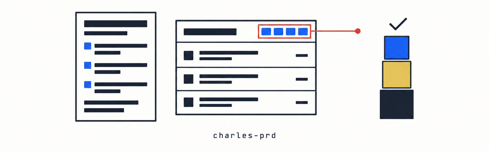

<div align="center">



   

</div>

Charles 的产品文档与原型规范，面向独立开发者的单人流程。

目标是几个月后还能回答三个问题：**为什么做、这一版做什么、界面和交互是什么**。核心取舍是能用一个文件解决就不拆成三个，目录随产品复杂度增长，而不是一开始就模拟一个二十人产品团队。

**本仓不依赖任何其它 skill。** 涉及编码规范、测试与交付闸门的部分一律写成通用表述，由使用者的项目决定具体是什么。

## 组成

| skill | 用途 |
| --- | --- |
| `charles-prd-standards` | 规范本体：目录结构、版本管理、任务与交互规格、原型、图、文字表达、导出交付、协作格式 |
| `charles-new-product` | 从零定义新产品：**先集中问清七类必答项，确认后一次产出全部文档、图、原型与 PDF** |
| `charles-legacy-prd` | 给已有项目补 PRD：扫描实现盘点功能、标注需求来源、区分设计与遗留 |
| `charles-prd-review` | PRD 评审：找需求矛盾、范围与目标脱节、无法判定的 Release Criteria |

## 安装

```bash
git clone https://github.com/CharlesHYF/charles-prd-skill.git ~/charles-prd-skill
```

```bash
# Claude Code（缺省目标 ~/.claude/skills）
bash ~/charles-prd-skill/tools/install-skills.sh

# 其它工具把目标 skills 目录作为参数传进去
bash ~/charles-prd-skill/tools/install-skills.sh ~/.agents/skills    # Codex / Qoder / Trae
bash ~/charles-prd-skill/tools/install-skills.sh ~/.trae/skills      # Trae 专属路径
bash ~/charles-prd-skill/tools/install-skills.sh ~/.rovodev/skills   # Rovo Dev
```

装完是三个软链，改完开发仓立即生效，不需要重新安装。

### Claude Code plugin 方式（可选）
```
/plugin marketplace add ~/charles-prd-skill
/plugin install charles-prd@charles-prd
```

### Gemini CLI
```bash
git clone https://github.com/CharlesHYF/charles-prd-skill.git ~/.gemini/extensions/charles-prd
```

## 更新

```bash
cd ~/charles-prd-skill && git pull origin main
```

软链方式下 pull 完即生效。

## 最小目录

```
project/docs/prd/
├── README.md              版本导航与状态
├── product.md             长期稳定的产品定义
├── decisions.md           跨版本的不可逆决策
└── versions/
    ├── 1.0/
    │   ├── prd.md         八个固定章节，需求带编号
    │   ├── scope.md       In Scope / Later / Out of Scope
    │   ├── notes.md       临时想法与待验证问题
    │   ├── prototype/     可点击的 HTML 原型
    │   └── diagrams/      PNG 加同名生成说明
    ├── 2.0/
    └── 3.0/
```

模板在 [`templates/prd-template/`](templates/prd-template/)，直接复制为起点。

## 结构校验器

`tools/check.sh` 把确定性规则变成会 fail 的检查，共八项：

```bash
bash tools/check.sh docs/prd
```

| 检查 | 内容 |
| --- | --- |
| 一 | 必需文件（`README.md`、`product.md`、`versions/`） |
| 二 | 版本目录命名（必须是明确版本号，禁止 current / latest / new） |
| 三 | 版本内必需文档（major 要 `prd.md` 与 `scope.md`，minor 至少要 `changes.md`） |
| 四 | `prd.md` 章节齐全与字段类型合规：版本历史、需求概述、产品描述、名词解释、整体流程、功能清单、功能需求、非功能需求、Non-goals、Release Criteria、未解决问题 |
| 五 | 需求编号存在且不重复 |
| 六 | 每张图有同名生成说明 |
| 七 | `README.md` 声明三个版本状态 |
| 八 | 任务编号唯一、六个小节齐全、流程图或无分支声明、交互规格七字段齐全、关联需求存在 |

说「一键出全部」时，新产品走 `charles-new-product`、已有项目走 `charles-legacy-prd`。前者先按七类必答项集中提问（产品形态、用户优先级、运行环境、内容来源、外部对接、关键数值、合规约束），确认后一次产出全部内容，不分批交付。

内容级的矛盾（需求打架、范围与目标脱节、判据无法判定）脚本查不了，由 `charles-prd-review` 的七类清单人工过。

## 导出 PDF

产品需求与任务规格**分开导出两份**，一条命令产出：

```bash
bash tools/export-prd.sh 1.0 --title "订阅管理工具"
```

| 产物 | 内容 | 读者 | 对外 |
| --- | --- | --- | --- |
| `prd-1.0.pdf` | 产品定义 + PRD + Scope | 合作方、需要签字的客户 | 是 |
| `tasks-1.0.pdf` | 任务与交互规格 | 实现者，含 AI Agent | 否，仅内部 |

分开的理由是读者不同、生命周期不同（PRD 发布即冻结、任务持续更新）、体量差三到五倍，以及错误文案与兜底策略属于内部细节不该对外承诺。

流程是 Markdown 渲染成带打印样式的 HTML，再用本机 Chrome 打印为 PDF。图用 Mermaid 写在 Markdown 里，导出时渲染成矢量 SVG，手绘风格，全程离线。产出带封面页、目录页、PDF 书签、页眉页脚页码、章节分页，需求编号与任务编号自动渲染成等宽高亮。排版样式在 [`templates/export/style.css`](templates/export/style.css)，两份样张见 [`templates/export/`](templates/export/)。

**Markdown 是唯一源头，PDF 只是产物。** 收到别人批注过的 PDF 时把改动搬回 Markdown，不接受 PDF 作为输入源。导出目录默认进 `.gitignore`，只有实际对外交付过的那一份才提交，文件名带日期与接收方。

首次运行会安装渲染依赖（markdown-it 与 puppeteer-core），之后离线可用。Chrome 路径可用 `CHROME_PATH` 覆盖。

## 核心约定

| 项目 | 规范 |
| --- | --- |
| 产品定义 | `product.md` 只写一次，版本相关内容一律进 `versions/<版本>/prd.md` |
| 版本目录 | 直接写明确版本号，发布后冻结，只允许修正笔误 |
| 版本与 Git | 发布时打 tag，tag 名与目录名对应 |
| PRD 结构 | 版本历史加七章；功能需求按模块分组，每个功能含场景描述、需求条目、字段定义、流程 |
| 名词解释 | 第一次出现的非通用术语必须进表，写清定义、取值范围、谁定的 |
| 字段定义 | 涉及数据的功能必须有六列字段表；**类型列写 SQL 类型**（VARCHAR/TINYINT/DECIMAL），禁止 String/Enum/Array 这类语言层写法 |
| 枚举字段 | 用 TINYINT 存编码并在约束列列出全部取值，禁止 ENUM 类型（改值要 ALTER TABLE） |
| 非功能需求 | 只写产品侧判据（权限可见性、数据留存、统计埋点、安全底线），工程指标归项目交付体系 |
| 需求编号 | `REQ-<版本>-<三位序号>`，不复用，作废时标注失效 |
| 任务编号 | `Task-<三位序号>`，版本内唯一，必须关联至少一个需求 |
| 任务结构 | 六个固定小节：关联需求、任务内容、界面、流程、交互规格、验收 |
| 流程图 | 有两个以上分支的操作必须画 Mermaid flowchart，从触发画到最终界面状态，节点 10 个以内 |
| 交互规格 | 七个必填字段：触发、前置条件、正常路径、边界情况、错误处理、兜底行为、显示规则 |
| 提示文案 | 在规格里写完整原文加引号，变量用大括号标出，不写"给出相应提示" |
| 需求表达 | 必须能写成测试用例，禁止"优化"、"提升体验"、"合理"这类无法判定的说法 |
| 原型定位 | 开发期间是交互事实来源，发布后转历史存档，实现代码成为唯一事实来源 |
| 原型规范 | 不受编码规范约束，但不许被复制进 `src/` |
| 图 | Mermaid 手绘风格**写在 prd.md 与 tasks.md 正文里**，不放进 diagrams/；界面标注图内联 SVG；`diagrams/` 只存外部导入的位图并配来源说明 |
| Release Criteria | 只写产品维度判据，工程标准由项目自己的交付体系管 |
| 决策落点 | 跨版本不可逆的进 `decisions.md`，模块级进实现文档，单次改动进 commit message |
| 文档语言 | 中文，`Non-goals` / `Release Criteria` / `In Scope` 这类术语保留英文 |
| 导出交付 | 分两份 PDF，产品需求对外、任务规格仅内部；Markdown 是唯一源头，导出目录默认不进 Git |
| 分析输出 | 编号列表，每条按问题描述、存在的隐患、解决方案三段写 |

## 仓库自测

```bash
bash tests/run_tests.sh          # check.sh 回归测试，19 项断言
bash tests/check_structure.sh    # skill 完整性、六处版本号、Markdown 死链
```
