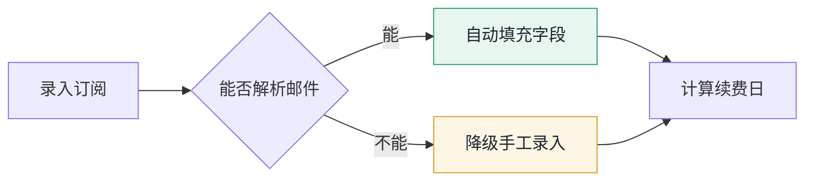
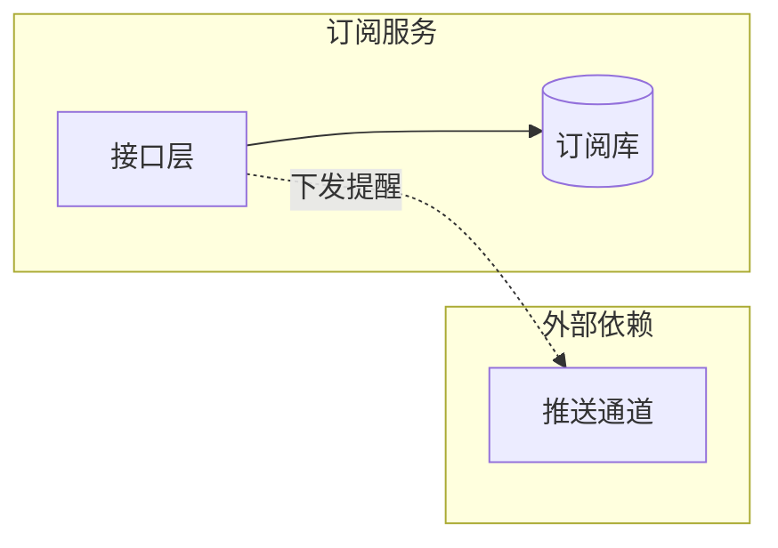

# Charles PRD -- 图
<!--
图的画法、类型选择、尺寸约束与界面标注图的做法
创建日期：2026-09-21
修改日期：2026-09-21
-->
> **图用 Mermaid 写在 Markdown 里，导出时渲染成矢量 SVG 进 PDF。** 图是文本，改图就是改代码，Git 里有可读 diff，不依赖任何外部服务。

## 默认做法
> **图直接写在 `prd.md` 与 `tasks.md` 正文里，不要单独放进 `diagrams/`。** 写进独立文件的话，正文与导出的 PDF 里都没有图。`diagrams/` 只存外部导入的位图。

在 Markdown 里直接写 ```mermaid 代码块，`tools/export-pdf.sh` 会用本机 Chrome 渲染成矢量图。全程离线，Mermaid 与图标包都在本地依赖里。

````markdown

````

图下一行写图注，说明这张图要解释什么、颜色代表什么。

## 图类型怎么选

| 要表达什么 | 用哪类 |
| --- | --- |
| 核心用户流程、分支与降级路径 | `flowchart` |
| 多方交互时序、边界分支 | `sequenceDiagram` |
| 对象状态流转 | `stateDiagram-v2` |
| 数据模型与实体关系 | `erDiagram` |
| 系统架构与模块依赖 | `flowchart` 配 `subgraph` |
| 用户旅程与体验断点 | `journey` |
| 版本计划与里程碑 | `gantt` |
| 需求优先级取舍 | `quadrantChart` |
| 产品版本路线 | `timeline` |

**架构图用 `flowchart` 加 `subgraph`，不用 `architecture-beta`**。后者是 beta 状态，跨组连线会走长斜线穿过分组框，分组样式也不受主题变量控制。用 `subgraph` 布局可控、配色统一，还能给连线加标签：



## 尺寸约束
> A4 页宽约 174mm，图被等比缩放后节点太多就会看不清。这是内容规模问题，不是配置能解决的。

- **横向图（LR）节点控制在 6 个以内**，超过就拆成两张，或改成纵向
- **纵向图（TD）节点控制在 10 个以内**，超过一页高度会被缩到看不清
- 一张图只表达一个问题，表达不完说明该拆
- 节点文字控制在 8 个字以内，超长会溢出节点框

## 视觉约束
主题配置在 [`templates/export/mermaid-theme.json`](../templates/export/mermaid-theme.json)，改它就能改全局风格，不要在单张图里写死颜色。

- **手绘风格全开**（`look: handDrawn`），对 flowchart 与 state 效果明显，sequence 与 er 因为靠对齐传递信息效果较弱，这是预期行为
- **配色沿用文档那套**：蓝 `#2563EB` 主色与关键步骤、黄 `#D99A2B` 提示与降级、绿 `#2E9E6B` 成功路径、红 `#D93025` 关键与阻塞
- 节点分色用 `classDef` 写语义类名，不给每个节点手写颜色
- 中文标注，技术名词保留英文
- **不使用 Emoji**
- **只画 PRD 里已定义的节点**，不自动补模块

## 界面标注图
> 界面标注需要精确的元素位置、框选范围与引线，Mermaid 是自动布局画不了。**这类图直接在 Markdown 里内联 SVG。**

- 内联 SVG 同样是文本，进 Git 有 diff，导出时是矢量，放大不糊
- 给 `<svg>` 加 `class="annotation"` 与 `viewBox`，尺寸由样式表控制
- **SVG 内部的 `<style>` 会影响整个文档**，所有选择器必须加 `.annotation` 前缀限定
- SVG 内部可以按可读性自由换行留空行。Markdown 的 HTML 块遇空行就结束，`render.mjs` 因此会在渲染前把整块 SVG 换成占位符、渲染后再放回，**不要移除这段保护逻辑**，否则空行后的内容会变成一堆源码输出到 PDF 里
- 画法要点：界面元素用细边框矩形，标注框用 `#D93025` 红色描边，引线从标注框引到说明文字并以小圆点收尾，说明文字用红色
- 标注内容写清元素位置与取值规则，**行为规格仍然写在交互规格表里**，图不替代表

```html
<svg class="annotation" viewBox="0 0 1600 900" role="img" aria-label="文件列表与操作区标注">
	<style>
		.annotation .ui { font-size: 19px; fill: #1f2430; }
		.annotation .mark { font-size: 20px; fill: #d93025; }
		.annotation .box-mark { fill: none; stroke: #d93025; stroke-width: 2.5; }
	</style>
	<!-- 界面元素与标注 -->
</svg>
```

完整范例见 [`templates/export/sample-tasks.md`](../templates/export/sample-tasks.md) 里 Task-001 的界面一节。

## 外部导入的位图
截图、照片、第三方工具产出的 PNG 这类**位图**才需要配同名 `.md` 说明来源与日期，因为它们无法从文本复现：

```
diagrams/
├── competitor-flow.png
└── competitor-flow.md
```

说明里写清来源、获取日期、用途。Mermaid 图与内联 SVG 是文本，不需要这个说明。
