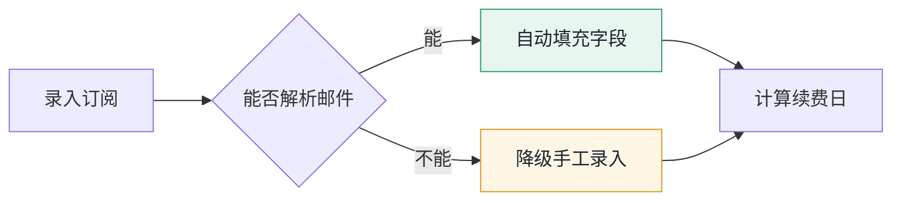
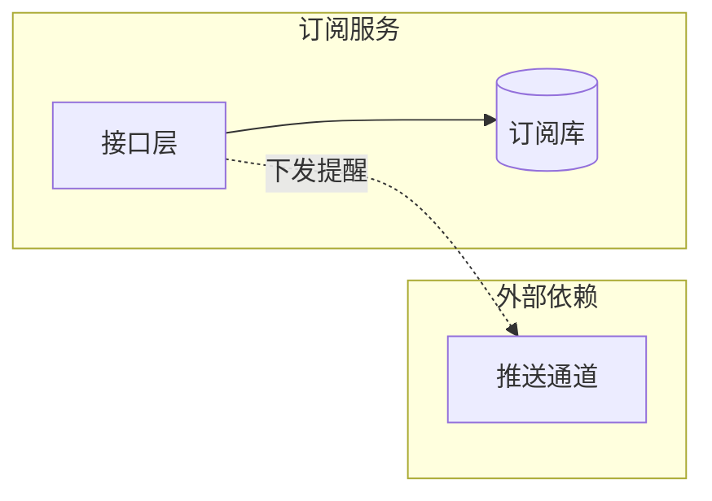

# Charles PRD -- 图
<!--
图的画法、类型选择、尺寸约束与界面标注图的做法
创建日期：2026-09-21
修改日期：2026-09-22
-->
> **图用 Mermaid 写在 Markdown 里，导出时渲染成矢量 SVG 进 PDF。** 图是文本，改图就是改代码，Git 里有可读 diff，不依赖任何外部服务。

## 默认做法
> **图直接写在 `prd.md` 与 `tasks.md` 正文里，不要单独放进 `diagrams/`。** 写进独立文件的话，正文与导出的 PDF 里都没有图。`diagrams/` 只存外部导入的位图。

在 Markdown 里直接写 ```mermaid 代码块，`tools/export-pdf.sh` 会用本机 Chrome 渲染成矢量图。全程离线，Mermaid 与图标包都在本地依赖里。

````markdown

````

图下一行写图注，说明这张图要解释什么、颜色代表什么。

## 图类型怎么选

| 要表达什么 | 用哪类 |
| --- | --- |
| 核心用户流程、分支与降级路径 | `flowchart` |
| 多方交互时序、边界分支 | `sequenceDiagram` |
| 对象状态流转 | `stateDiagram-v2` |
| 数据模型与实体关系 | `erDiagram` |
| 系统架构与模块依赖 | `flowchart` 配 `subgraph` |
| 用户旅程与体验断点 | `journey` |
| 版本计划与里程碑 | `gantt` |
| 需求优先级取舍 | `quadrantChart` |
| 产品版本路线 | `timeline` |

**架构图用 `flowchart` 加 `subgraph`，不用 `architecture-beta`**。后者是 beta 状态，跨组连线会走长斜线穿过分组框，分组样式也不受主题变量控制。用 `subgraph` 布局可控、配色统一，还能给连线加标签：



## 尺寸约束
> A4 页宽约 174mm，图被等比缩放后节点太多就会看不清。这是内容规模问题，不是配置能解决的。

- **横向图（LR）节点控制在 6 个以内**，超过就拆成两张，或改成纵向
- **纵向图（TD）节点控制在 10 个以内**，超过一页高度会被缩到看不清
- 一张图只表达一个问题，表达不完说明该拆
- 节点文字控制在 8 个字以内，超长会溢出节点框

## 视觉约束
主题配置在 [`templates/export/mermaid-theme.json`](../templates/export/mermaid-theme.json)，改它就能改全局风格，不要在单张图里写死颜色。

- **手绘风格全开**（`look: handDrawn`），对 flowchart 与 state 效果明显，sequence 与 er 因为靠对齐传递信息效果较弱，这是预期行为
- **配色沿用文档那套**：蓝 `#2563EB` 主色与关键步骤、黄 `#D99A2B` 提示与降级、绿 `#2E9E6B` 成功路径、红 `#D93025` 关键与阻塞
- 节点分色用 `classDef` 写语义类名，不给每个节点手写颜色
- 中文标注，技术名词保留英文
- **不使用 Emoji**
- **只画 PRD 里已定义的节点**，不自动补模块

## 画到什么程度算画全
> 下面每条都能核对真假。**图缺一块，开发就要来问一次，或者自己猜一个。**

### 按钮触发的界面必须单独出图
点击后出现的每一个界面都是一张独立的标注图，用清单的 `setup` 触发：

| 触发出来的东西 | 要不要单独出图 |
| --- | --- |
| 弹窗、抽屉、侧滑面板 | 要 |
| 下拉面板、日期选择器、级联选择 | 要 |
| 气泡确认、悬浮提示 | 要 |
| Toast、全局提示条 | 要，可以和触发它的页面同图 |
| 页面跳转 | 不要，目标页自己是一张图 |

### 弹出内容里的每个元素都要标
**不是标一个「弹窗」框就完事。**弹窗里有几个元素就标几条：

- 标题：固定文案还是带变量，带变量写清变量来源
- 正文：每一段单独标。含数量、金额、单号这类动态内容的，写清取值来源与为空时怎么显示
- 每个表单字段：默认值、必填与否、校验规则、错误提示原文
- 每个按钮：置灰条件、点击后的加载态、成功与失败各自的界面反应
- 关闭方式：右上角关闭、取消按钮、点遮罩、按 Esc，哪些可用哪些不可用
- 二次确认弹窗还要写清确认后的三种结果：全部成功、部分失败、整体失败分别是什么界面

### 流程图要走到终态
- **每个分支都落到一个明确的终态**，不能停在「执行」「处理」这种中间节点
- **失败路径与成功路径同等对待**，只画 happy path 等于没画
- 流程图里出现的每个界面状态，在标注图里要能找到对应的那张图
- 降级路径写清降到哪里，不写"做兜底处理"这类无法判定的说法

### 架构图要画到边界
- 只画 PRD 里已定义的模块，不自动补
- 每个外部依赖标出对接方向，以及它不可用时系统怎么办
- 数据写入方向与读取方向分开画，不用一根双向箭头糊过去

## 界面标注图
> **界面标注图标注的是原型本身，不是另画一个界面示意。** 手画的界面和原型必然对不上，原型一改标注就过期。

分两步：先截图并量坐标，再按元素文案写标注。截图与坐标在同一时刻产出，严格对应。

### 第一步：截图清单
`versions/<版本>/diagrams/<截图名>.json`，说清截哪个页面、什么角色、什么状态：

```json
{
	"shot": "list",
	"page": "../prototype/pages/list.html",
	"title": "订单列表页",
	"role": "manager",
	"state": "success",
	"setup": ["[data-open-modal=deleteModal]"]
}
```

```bash
node tools/capture.mjs docs/prd/versions/1.0/diagrams/list.json
```

产出 `list.png`、`list.md`（位图来源说明）与 `_coords.json` 里的一个条目。截图前会自动移除原型的状态切换条，那是调试工具不是产品界面。

### 第二步：标注清单
`versions/<版本>/diagrams/<截图名>.marks.json`，**按元素文案挑，不写坐标也不写 CSS 选择器**：

```json
{
	"shot": "list",
	"inject": "../tasks.md",
	"mark": "list",
	"marks": [
		{ "el": "筛选条", "kind": "box", "note": "订单号支持前缀匹配。" },
		{
			"el": "批量作废",
			"kind": "btn",
			"steps": [
				"未勾选任何行时置灰，悬停提示先选择订单",
				"点击后弹二次确认，列出将作废的订单号与总金额",
				"部分失败则保留失败清单不关弹窗，让人能重试"
			]
		}
	]
}
```

```bash
node tools/annotate.mjs docs/prd/versions/1.0/diagrams/list.marks.json
```

生成的 SVG 写进 `inject` 指向文档里这对标记之间，重跑覆盖，不会追加：

```markdown
### 界面

<!--annotation:list-->
<!--/annotation-->

图注：底图为原型真实截图，标注框坐标取自截图时的 DOM 量测。
```

### 清单字段
| 字段 | 在哪份 | 作用 |
| --- | --- | --- |
| `shot` | 两份都有 | 截图名，两份靠它对应 |
| `page` | 截图清单 | 原型页面路径，相对清单文件 |
| `role` / `state` | 截图清单 | 截图前切到哪个角色、哪个状态 |
| `setup` | 截图清单 | 截图前依次点击的选择器，用来截弹窗这类要先触发的界面 |
| `crop` / `cropPad` | 截图清单 | 裁到某个元素及其周边，弹窗整页截完在 A4 上小到读不出文案 |
| `inject` / `mark` | 标注清单 | 写进哪个文档的哪对标记之间 |
| `marks[].el` | 标注清单 | 元素文案，按包含匹配 |
| `marks[].kind` | 标注清单 | 限定类型：btn / link / menu / field / th / kpi / box |
| `marks[].index` | 标注清单 | 同名元素有多个时取第几个，从 0 开始 |
| `marks[].note` | 标注清单 | 一句话说明 |
| `marks[].steps` | 标注清单 | 多步骤说明，按 1. 2. 3. 编号排版 |

`_coords.json` 里列出了页面上所有可标注元素的 `kind` 与 `txt`，写标注清单时照着挑。找不到元素时脚本会把候选列出来。

### 几条硬要求
- **按钮逐个标注。** 页面上每个按钮、每个筛选控件、每个可点击的链接都要有一条，漏掉的就是没想清楚的
- **点击后有多步行为的写 `steps` 不写 `note`。** 置灰条件、二次确认、成功与失败各自的界面反应，分步写清楚
- **不要手写坐标，也不要手改生成的 SVG**，改了下次重跑就没了。要改内容改标注清单
- **原型改动后先重跑 `capture.mjs` 再重跑 `annotate.mjs`**，只跑后者会拿旧坐标画新说明
- 弹窗、空态、失败态各自出一张图，用 `setup` 与 `state` 区分
- **弹窗要配 `crop`**，整页截完弹窗只占中间一小块，缩到正文宽度后里面的文案读不出来。裁过的小截图会被等比放大填满图区，不用担心变小
- PNG 与 `_coords.json` 都要进 Git，评审的人不必装 Node 也能看

标注图在导出时占满正文版心，与段落、表格左右对齐，不单独开横向页——横向页的版心是 273mm，正文是 174mm，两者放在一起左右边界对不上。

代价是图会被缩到版心宽度，所以标注图按"缩完还要能读"来生成：说明区宽 1000px、说明字号 27px、编号圆点半径 15px、框线 3px。这些是 `tools/annotate.mjs` 里的常量，改之前先想清楚缩放后的实际字号。

## 外部导入的位图
截图、照片、第三方工具产出的 PNG 这类**位图**才需要配同名 `.md` 说明来源与日期，因为它们无法从文本复现：

```
diagrams/
├── competitor-flow.png
└── competitor-flow.md
```

说明里写清来源、获取日期、用途。Mermaid 图与内联 SVG 是文本，不需要这个说明。
