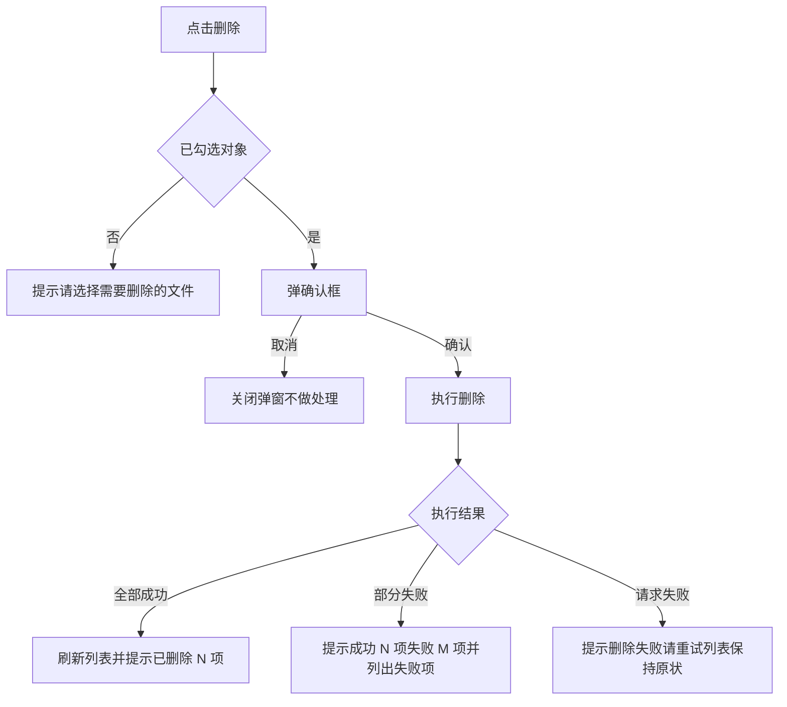

# Charles PRD -- 任务与交互规格
<!--
任务编号、固定结构与交互规格的必填字段
创建日期：2026-09-21
修改日期：2026-09-23
-->
> 需求（REQ）说**做什么**，任务（Task）说**怎么做**。任务是开发可以直接照着实现的粒度，带界面图与完整交互规格。

## 两层编号

| 层 | 编号 | 回答什么 | 写在哪 |
| --- | --- | --- | --- |
| 需求 | `REQ-<版本>-<三位序号>` | 这一版要提供什么能力 | `versions/<版本>/prd.md` |
| 任务 | `Task-<三位序号>` | 某个能力具体怎么交互 | `versions/<版本>/tasks.md` |

- Task 编号**在单个版本内唯一**，引用时带版本路径（`1.0/Task-001`）避免跨版本歧义
- 每个 Task **必须关联至少一个需求编号**，没有关联需求的任务说明它不该存在，或者需求漏写了
- 一个需求可以拆成多个任务，一个任务也可以同时服务多个需求

## 任务的固定结构
> 六个小节不增不减。少任何一节都会让开发在实现时回头问。

```markdown
## Task-001：删除文件与文件夹

**关联需求**：REQ-1.0-003

### 任务内容
一句话说清这个任务要实现什么，不展开细节。

### 界面
<!--annotation:file-list-->
<!--/annotation-->

图注：删除按钮在列表右上角操作区，与重命名、新建文件夹同一组。

### 流程
（Mermaid flowchart，从触发到最终状态的完整走向，见下）

### 交互规格
（固定字段表格，见下）

### 验收
- 可以直接照着验证的条目，每条都能判断真假
```

## 交互规格的必填字段
> 这张表是任务的核心。**每个字段都要填，不适用就写"不适用"并说明原因**，留空等于没想清楚。

| 字段 | 要回答什么 | 举例 |
| --- | --- | --- |
| 触发 | 什么操作触发，单击、双击、长按还是键盘 | 点击操作区"删除"按钮 |
| 前置条件 | 执行前必须满足什么状态 | 列表中已勾选至少一个对象 |
| 正常路径 | 一步步走通的流程与最终界面状态 | 弹确认框，确认后删除，刷新列表，提示"已删除 N 项" |
| 边界情况 | 未选中、多选、空数据、首层末层、超长输入分别怎么处理 | 未勾选时提示"请选择需要删除的文件/文件夹"，不弹确认框 |
| 错误处理 | 失败时显示什么文案，界面回到什么状态 | 网络失败提示"删除失败，请重试"，列表保持原状 |
| 兜底行为 | 依赖不可用或部分失败时怎么降级 | 部分失败时列出失败项名称与原因，成功项保留删除结果 |
| 显示规则 | 字段为空或不适用时显示什么，状态如何呈现 | 删除执行中按钮置灰，防止重复点击 |

## 流程图是必需的
> 点击按钮或触发某个动作之后走向哪里，**用 Mermaid flowchart 画出来**。规格表逐字段说清每种情况的行为与文案，流程图让人一眼看清分支结构，两者互补不重复。

- **有两个以上分支的操作必须画**，包括校验失败、用户取消、部分成功、请求失败这些路径
- 纯展示类、单一路径无分支的任务可以省略，但要在该小节写明"单一路径，无分支"
- 从触发画到最终界面状态，不要画到一半停在"调用接口"
- 分支的判定条件写在连线标签上，不要写在节点里
- **节点控制在 10 个以内**。画不下说明这个任务粒度太大，该拆成两个 Task



流程图里的提示文案可以简写，**完整原文写在交互规格表里**。

## 边界情况要穷举
> 写"处理各种异常"等于什么都没写。把分支列全，每个分支给出具体行为。

以一个下载按钮为例，四个分支都要写：

| 条件 | 行为 |
| --- | --- |
| 勾选多个对象 | 压缩打包后下载 |
| 勾选单个文件夹 | 打包压缩该文件夹后下载 |
| 勾选单个文件 | 直接下载该文件 |
| 未勾选任何对象 | 提示"是否下载当前文件夹内容"，确认后压缩当前文件夹 |

## 提示文案写原文
- 所有提示、错误、确认文案**在规格里写出完整原文**，加引号，不写"给出相应提示"
- 文案里的变量用大括号标出：`已删除 {count} 项`
- 同一类提示在不同任务里要用同一套说法，不要一处写"请选择"另一处写"请先选中"

## 界面图的要求
- 每个 Task 至少一张界面图，标出本任务涉及的元素位置
- **界面标注图由 `tools/capture.mjs` 截图量坐标、`tools/annotate.mjs` 生成并写回文档**，标注清单按元素文案挑，不写坐标，做法见 [diagrams](diagrams.md)
- **页面上每个按钮、每个筛选控件、每个可点击链接都要有一条标注**，点击后有多步行为的用 `steps` 分步写
- **按钮触发弹出的界面要单独出图，弹出内容里有几个元素就标几条**，标题、正文每一段、每个字段、每个按钮、关闭方式都要写，细则见 [diagrams](diagrams.md) 的"画到什么程度算画全"
- 弹窗、空态、失败态各自出一张图，在清单里用 `setup` 与 `state` 区分
- 产品声明适配移动端时，每张桌面标注图都要有对应的手机标注图，做法见 [diagrams](diagrams.md) 的手机截图
- **图上的标注不能代替交互规格表**。图说明位置，表说明行为，两者都要有

## 任务文档不对外
- 任务规格是**内部实现文档**，导出的 `tasks-<版本>.pdf` 默认不发给客户与外部评审方
- 错误文案、兜底策略、边界处理发出去容易被当成承诺，而这些内容在开发期间还会改
- 客户明确要求确认功能边界时才单独发，并在该版本 `notes.md` 的交付记录里注明
- 分工细则见 [export](export.md)

## 什么时候拆成目录
先把全部任务写在 `versions/<版本>/tasks.md` 一个文件里。出现下面任一情况再拆成 `tasks/Task-001.md` 逐个成文件：

- 单个任务超过一屏，反复上下翻
- 任务数量超过二十个
- 多人同时改不同任务，合并频繁冲突
