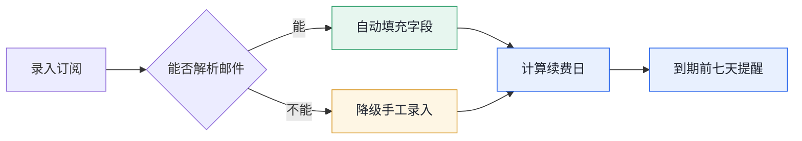
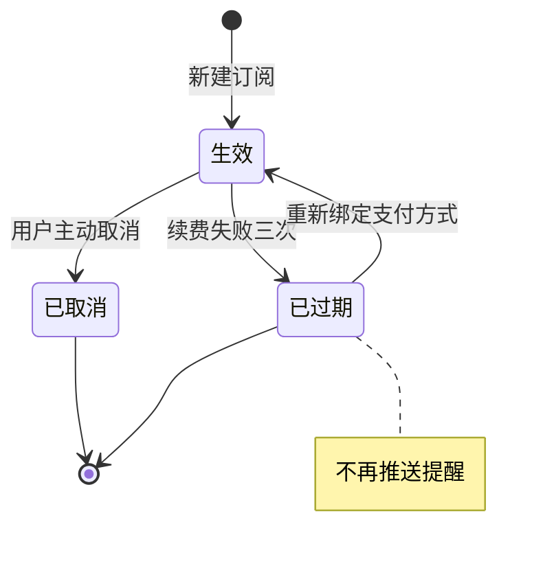
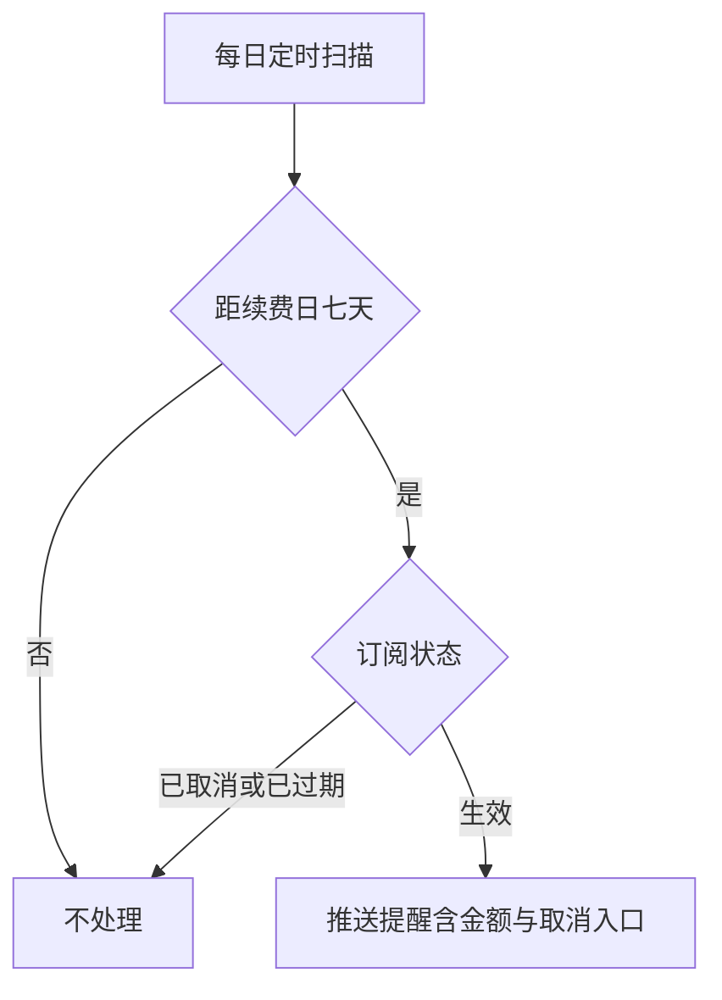

# 产品定义

## 是什么
一个面向独立开发者的订阅管理工具，把分散在邮箱、账单和各家后台的订阅集中到一处。

## 目标用户
同时维护三个以上付费订阅的独立开发者与小团队负责人。

## 核心问题
订阅散落在各家平台，续费日期、金额和用途需要逐个后台查，经常出现忘记取消导致的重复扣款。

## 价值
一处看全部订阅，续费前主动提醒，取消路径直达。

## 产品原则
- 只做记录与提醒，不代管支付凭证
- 数据本地优先，云端同步是可选项
- 任何提醒都要给出可执行的下一步

---

# Product 1.0

## 版本历史

| 版本 | 日期 | 变更内容 | 修订人 |
| --- | --- | --- | --- |
| 1.0 | 2026-09-22 | 初版，定义手工录入、邮箱解析、续费提醒三块能力 | Charles |

## 1. 需求概述

### 产品背景
当前用表格手工维护订阅清单，续费日期靠记忆，过去半年出现两次重复扣款，单次损失在两百元以内但发现时已过退款窗口。

### 本版目标
上线三个月内，用户能在一处看到全部订阅，并在续费前七天收到带取消入口的提醒。

### 价值点
把「忘记取消导致的重复扣款」从每半年两次降到零。对独立开发者而言，订阅数量通常在十到三十个之间，人工记忆必然出错。

### 涉及系统

| 系统 | 对接内容 | 对接方 |
| --- | --- | --- |
| 邮箱服务商 | 读取账单邮件，解析订阅金额与周期 | 待定，1.0 先支持 Gmail |
| 推送通道 | 发送续费提醒 | 系统通知，不接第三方 |

### 风险说明

| 风险 | 影响 | 应对 |
| --- | --- | --- |
| 邮件格式各家不同，解析准确率不可控 | 自动录入不可用，退回手工 | 解析失败时降级为手工录入，不阻断流程 |
| 邮箱授权被用户拒绝 | 无法读取账单 | 手工录入为主路径，邮箱解析是加速手段 |

## 2. 产品描述

### 名词解释

| 名词 | 定义 | 取值范围 | 定义来源 |
| --- | --- | --- | --- |
| 续费周期 | 两次扣款之间的间隔 | 月度 / 季度 / 年度 | 本文档 |
| 下次续费日 | 由上次扣款日与周期推算出的下一次扣款日期 | 日期 | 本文档 |
| 订阅状态 | 该订阅当前是否仍在扣款 | 生效 / 已取消 / 已过期 | 本文档 |
| 归档 | 已取消订阅的存放区，不参与列表排序 | -- | 本文档 |

### 整体流程

图注：绿色为顺利路径，黄色为降级路径，蓝色为系统关键步骤。

### 功能清单

| 模块 | 功能 | 优先级 | 说明 |
| --- | --- | --- | --- |
| 订阅管理 | 手工录入订阅 | P0 | 必填五个字段，提交后进入列表 |
| 订阅管理 | 订阅列表与归档 | P0 | 按下次续费日升序，已取消移入归档区 |
| 订阅管理 | 邮箱账单解析 | P1 | 解析失败降级手工，不阻断流程 |
| 提醒 | 续费提醒推送 | P0 | 到期前七天推送，含金额与取消入口 |

## 3. 功能需求

### 3.1 订阅管理

#### 场景描述
用户第一次使用时手工录入现有订阅；之后每新增一个付费服务就录入一条。已取消的订阅不删除，移入归档区保留历史。

#### 需求条目

- REQ-1.0-001 支持手工录入订阅，必填字段为服务名称、金额、币种、续费周期、下次续费日
- REQ-1.0-002 支持从邮箱账单解析订阅信息，解析失败时降级为手工录入，不阻断流程
- REQ-1.0-003 订阅列表按下次续费日升序排列，已取消的订阅移入归档区不参与排序
- REQ-1.0-004 已失效：原计划支持按标签分组，改为 2.0 的 REQ-2.0-002

#### 字段定义

| 字段 | 类型 | 必填 | 约束 | 默认值 | 说明 |
| --- | --- | --- | --- | --- | --- |
| serviceName | String | 是 | 长度 1 到 60 | 无 | 服务名称，展示用，不做唯一性约束 |
| amount | Decimal | 是 | 大于 0，保留两位小数 | 无 | 单次扣款金额 |
| currency | String | 是 | 遵循 ISO 4217 | CNY | 币种代码 |
| cycle | Enum | 是 | 月度 / 季度 / 年度 | 月度 | 续费周期 |
| nextChargeDate | Date | 是 | 不早于今天 | 无 | 下次续费日，由周期与上次扣款日推算 |
| status | Enum | 是 | 生效 / 已取消 / 已过期 | 生效 | 订阅状态 |

#### 流程

### 3.2 提醒

#### 场景描述
系统在续费日前主动提醒用户，用户点击提醒可直达该服务的取消页面，避免因遗忘产生非预期扣款。

#### 需求条目

- REQ-1.0-005 续费日前七天推送提醒，提醒内容包含金额与取消入口
- REQ-1.0-006 续费日计算在跨月与闰年场景下结果正确，上次扣款日为 31 号而下月只有 30 天时取当月最后一天

#### 流程

## 4. 非功能需求

### 权限与可见性
单人使用，无多角色。订阅数据仅本人可见，不提供分享与协作入口。

### 数据留存
订阅记录与扣款历史永久保留，用户主动删除后进回收站保留 30 天。已取消订阅不自动清理。

### 统计与埋点
记录三类行为以回答「提醒是否有效」：提醒送达、提醒点击、点击后 24 小时内是否发生取消操作。不记录订阅的具体服务名称用于统计。

### 安全底线
不存储支付凭证与银行卡信息。邮箱授权令牌加密存储，日志与导出文件中不出现令牌、金额明细与服务名称。

## 5. Non-goals
- 不做自动取消订阅，只提供取消入口的跳转
- 不做多人协作与费用分摊
- 不接入支付渠道

## 6. 成功标准 / Release Criteria

- 用户能在三分钟内完成首次录入并看到完整列表
- 提醒送达率不低于百分之九十五
- 续费日计算在跨月与闰年场景下结果正确
- 邮箱解析失败时能正常降级到手工录入，主流程不中断

## 7. 未解决问题

1. **邮箱解析的准确率**：目前只在十封测试邮件上跑通，需要真实样本验证。不定会影响 REQ-1.0-002 是否保留在 1.0
2. **多币种是否统一折算展示**：取决于首批用户的实际构成，影响列表展示与 amount 字段的处理方式

---

# Scope

## In Scope
- 手工录入与订阅列表
- 续费提醒推送
- 邮箱账单解析（解析失败可降级）

## Later
- 按标签分组，见 REQ-2.0-002
- 多币种统一折算展示
- 数据导出

## Out of Scope
> 这一节比 In Scope 更重要，它是后面拒绝范围蔓延的依据。

- 自动取消订阅：涉及各家平台的账号操作，风险不可控
- 多人协作与费用分摊：1.0 只服务单人场景
- 接入支付渠道：不代管支付凭证是产品原则
