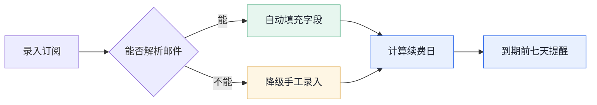
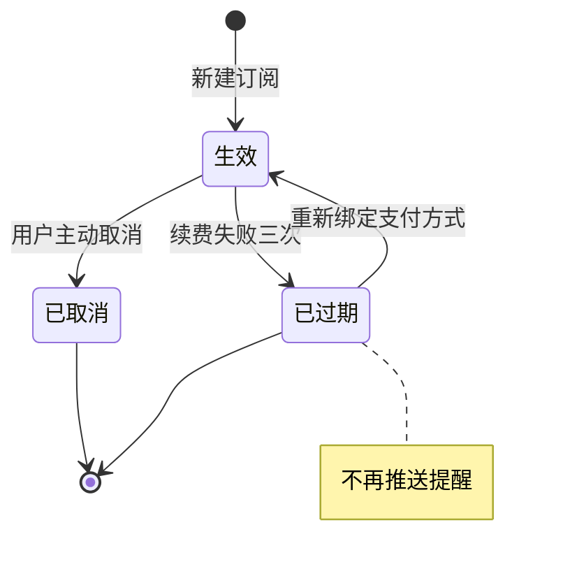

# 产品定义

## 是什么
一个面向独立开发者的订阅管理工具，把分散在邮箱、账单和各家后台的订阅集中到一处。

## 目标用户
同时维护三个以上付费订阅的独立开发者与小团队负责人。

## 核心问题
订阅散落在各家平台，续费日期、金额和用途需要逐个后台查，经常出现忘记取消导致的重复扣款。

## 价值
一处看全部订阅，续费前主动提醒，取消路径直达。

## 产品原则
- 只做记录与提醒，不代管支付凭证
- 数据本地优先，云端同步是可选项
- 任何提醒都要给出可执行的下一步

---

# Product 1.0

## 背景
当前用表格手工维护订阅清单，续费日期靠记忆，过去半年出现两次重复扣款。

## 目标用户与核心问题
这一版只服务单人使用场景，解决"续费前不知情"这一个问题，不处理团队协作与费用分摊。

## 这一版的目标
上线三个月内，用户能在一处看到全部订阅，并在续费前七天收到提醒。

## Non-goals
- 不做自动取消订阅
- 不做多人协作与权限
- 不接入支付渠道

## 核心用户流程
用户导入或手工录入订阅，系统按续费周期计算下次扣款日，到期前推送提醒，用户点击提醒直达该服务的取消页面。



图注：绿色为顺利路径，黄色为降级路径，蓝色为系统关键步骤。

## 主要功能与行为
- REQ-1.0-001 支持手工录入订阅，必填字段为服务名称、金额、币种、续费周期、下次续费日
- REQ-1.0-002 支持从邮箱账单解析订阅信息，解析失败时降级为手工录入，不阻断流程
- REQ-1.0-003 续费日前七天推送提醒，提醒内容包含金额与取消入口
- REQ-1.0-004 订阅列表按下次续费日升序排列，已取消的订阅移入归档区不参与排序
- REQ-1.0-005 已失效：原计划支持按标签分组，改为 2.0 的 REQ-2.0-002

## 成功标准 / Release Criteria
- 用户能在三分钟内完成首次录入并看到完整列表
- 提醒送达率不低于百分之九十五
- 续费日计算在跨月与闰年场景下结果正确

## 未解决问题
- 邮箱解析的准确率需要真实样本验证，目前只在十封测试邮件上跑通
- 多币种订阅是否需要统一折算展示，取决于首批用户的实际构成

---

# 附录

## 字段定义

| 字段 | 类型 | 必填 | 说明 |
| --- | --- | --- | --- |
| serviceName | String | 是 | 服务名称，展示用，不做唯一性约束 |
| amount | Decimal | 是 | 单次扣款金额，保留两位小数 |
| currency | String | 是 | 币种代码，遵循 ISO 4217 |
| cycle | Enum | 是 | 续费周期，取值为月度、季度、年度 |
| nextChargeDate | Date | 是 | 下次续费日，由周期与上次扣款日推算 |
| status | Enum | 是 | 订阅状态，取值为生效、已取消、已过期 |

## 续费日计算规则

> 跨月场景需要特别处理：上次扣款日为 31 号而下月只有 30 天时，续费日取当月最后一天，不顺延到下月 1 号。

```js
const nextChargeDate = (lastCharge, cycle) => {
	const next = new Date(lastCharge);
	const targetDay = next.getDate();

	next.setMonth(next.getMonth() + CYCLE_MONTHS[cycle]);

	if (next.getDate() !== targetDay) {
		next.setDate(0);
	}

	return next;
};
```

行内代码示例：状态字段用 `status` 而不是 `state`，与数据库字段保持一致。

## 状态流转



已取消状态保留历史记录，不从列表中物理删除。

## 参考

- 币种代码标准：ISO 4217
- 提醒推送的时区处理遵循用户设备本地时区
