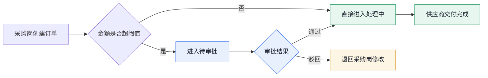
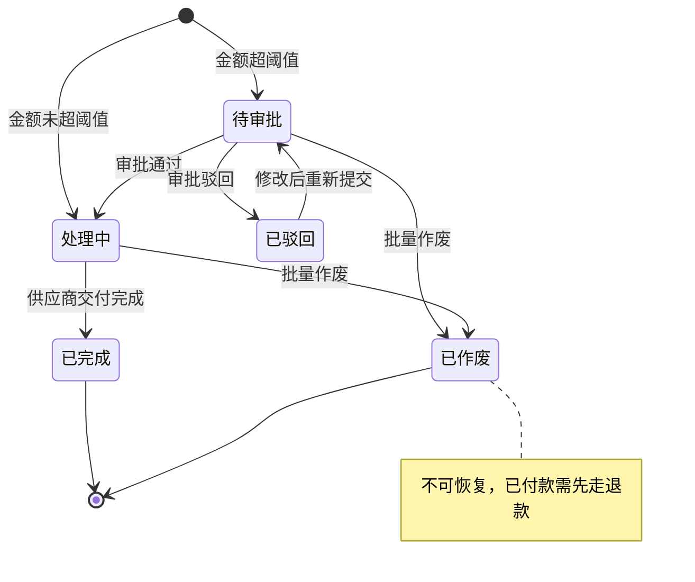
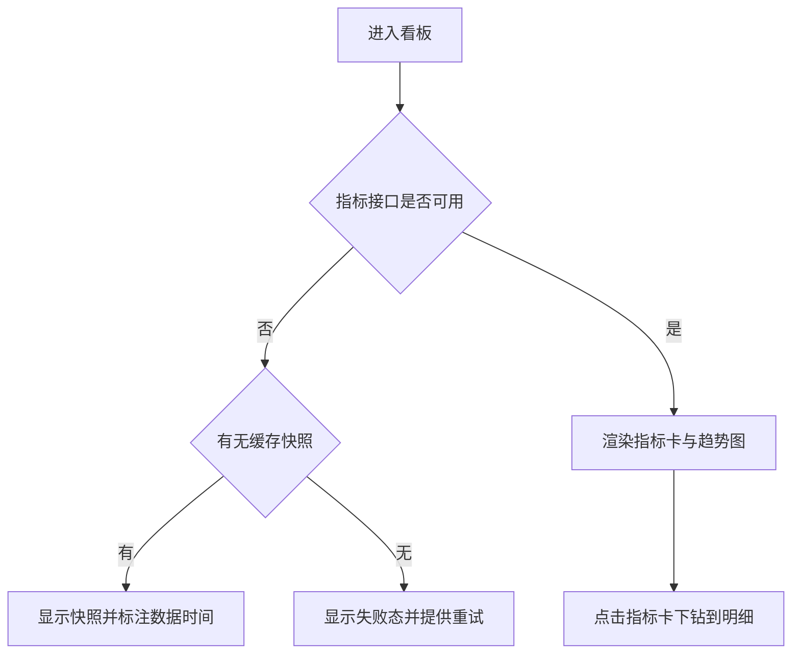

# 产品定义

## 是什么
一个面向中小制造企业的采购订单协同系统，把散在微信、邮件和线下单据里的采购流程收进一处。

## 目标用户
有固定供应商、每月采购单量在三百到八百之间的制造企业，采购与审批由不同的人负责。

## 核心问题
订单状态靠人问：采购岗不知道审批到哪一步，审批岗不知道哪些单等着自己，财务不知道这个月付了多少。催单靠微信，出错靠事后对账。

## 价值
订单状态一处可查，待办自动到人，经营数据当天可见。

## 角色

| 角色 | 职责 | 可操作范围 |
| --- | --- | --- |
| 采购岗 | 创建、提交、跟踪采购订单 | 自己创建的订单，可查看全部订单状态 |
| 审批岗 | 审批与批量作废订单，查看经营看板 | 全部订单，含金额与供应商明细 |

## 产品原则
- 状态变更必须留痕，谁在什么时候改了什么都能查
- 不可逆操作一律二次确认，并列清受影响的单据
- 看板只呈现已有数据，宁可显示空态也不显示 0 冒充

---

# Product 1.0

## 版本历史

| 版本 | 日期 | 变更内容 | 修订人 |
| --- | --- | --- | --- |
| 1.0 | 2026-09-22 | 初版，定义订单管理、批量操作、经营看板三块能力 | Charles |

## 1. 需求概述

### 产品背景
当前采购订单用 Excel 维护，审批走微信截图。过去半年出现三次重复下单，单次金额在八万到十九万之间，均因采购岗不知道同事已经下过同一张单。

### 本版目标
上线三个月内，采购与审批全程在系统内完成，订单状态不再需要人工询问，审批岗每天进系统就能看到自己的待办。

### 价值点
把"重复下单"从每半年三次降到零，把"审批到哪一步"从平均两次询问降到零次。按单次八万计，一次重复下单的损失就超过系统半年的投入。

### 涉及系统

| 系统 | 对接内容 | 对接方 |
| --- | --- | --- |
| 供应商主数据 | 读取供应商名称、结算方式与信用额度 | ERP 团队，1.0 先做单向读取 |
| 财务系统 | 写入已审批订单的应付信息 | 财务团队，1.0 按日批量推送 |
| 站内通知 | 发送待办与结果通知 | 系统内置，不接第三方 |

### 风险说明

| 风险 | 影响 | 应对 |
| --- | --- | --- |
| 供应商主数据在 ERP 里不全，部分供应商没有结算方式 | 订单创建时字段缺失 | 允许手工补录并标记为待核实，不阻断下单 |
| 财务系统的接口档期晚于本版上线 | 应付信息无法自动写入 | 1.0 先提供导出，接口就绪后切换为自动推送 |

## 2. 产品描述

### 名词解释

| 名词 | 定义 | 取值范围 | 定义来源 |
| --- | --- | --- | --- |
| 采购订单 | 一次采购行为的完整记录，含供应商、明细与金额 | -- | 本文档 |
| 订单状态 | 订单当前所处的流转阶段 | 1 待审批 / 2 处理中 / 3 已完成 / 4 已驳回 / 5 已作废 | 本文档 |
| 作废 | 终止一张尚未完成的订单，不可恢复 | -- | 本文档 |
| 延期风险订单 | 预计交期晚于约定交期的订单 | -- | 本文档 |

### 整体流程

图注：绿色为顺利路径，黄色为退回路径，蓝色为需要人工判断的环节。

### 功能清单

| 模块 | 功能 | 优先级 | 说明 |
| --- | --- | --- | --- |
| 订单管理 | 订单列表与筛选 | P0 | 三个筛选条件，按创建日期倒序 |
| 订单管理 | 订单创建与提交 | P0 | 必填六个字段，超阈值自动进审批 |
| 订单管理 | 批量作废 | P0 | 仅审批岗可用，二次确认后逐条提交 |
| 经营看板 | 指标卡与趋势图 | P0 | 四个指标可下钻，至少一张趋势图 |

## 3. 功能需求

### 3.1 订单管理

#### 场景描述
采购岗每天创建若干张订单并跟踪状态；审批岗每天进系统处理待办，对已经不需要的订单批量作废。

#### 需求条目

- REQ-1.0-001 订单列表支持按订单号前缀、状态、创建日期筛选，三个条件之间是且的关系
- REQ-1.0-002 支持创建订单，必填字段为供应商、金额、币种、约定交期、采购明细与备注
- REQ-1.0-003 审批岗可批量作废订单，作废前二次确认并列出受影响的单号与金额合计，作废后不可恢复
- REQ-1.0-004 已失效：原计划支持订单模板一键复制，改为 2.0 的 REQ-2.0-002

#### 字段定义

| 字段 | 类型 | 必填 | 约束 | 默认值 | 说明 |
| --- | --- | --- | --- | --- | --- |
| orderId | BIGINT | 是 | 主键，应用层生成的分布式 ID | 无 | 订单唯一标识 |
| orderNo | VARCHAR(24) | 是 | 唯一，格式 PO-yyyyMMdd-三位序号 | 无 | 订单号，展示与检索用 |
| supplierId | BIGINT | 是 | 外键，指向供应商主数据 | 无 | 供应商标识 |
| amount | DECIMAL(12,2) | 是 | 大于 0 | 无 | 订单总金额，单位元 |
| currency | VARCHAR(3) | 是 | 遵循 ISO 4217 | CNY | 币种代码 |
| promisedDate | DATE | 是 | 不早于创建日期 | 无 | 约定交期 |
| status | TINYINT | 是 | 1 待审批 / 2 处理中 / 3 已完成 / 4 已驳回 / 5 已作废 | 1 | 订单状态 |
| createdBy | BIGINT | 是 | 外键，指向用户表 | 无 | 创建人 |
| createdAt | DATETIME | 是 | 系统写入，不可修改 | 无 | 创建时间 |

#### 流程

### 3.2 经营看板

#### 场景描述
审批岗每天早上看一眼看板，确认本月订单量、待审批积压与延期风险，异常的指标点进去看明细。

#### 需求条目

- REQ-1.0-020 看板展示本月订单数、待审批数、延期风险订单数与本月已付款金额，每个指标可下钻到对应明细
- REQ-1.0-021 看板至少提供一张趋势图，指标接口不可用时显示缓存快照并标注数据截止时间，不显示 0

#### 流程

## 4. 非功能需求

### 权限与可见性
两个角色。采购岗只能修改自己创建的订单，可查看全部订单的状态但看不到其他人订单的金额明细；审批岗可见全部订单与经营看板。

### 数据留存
订单与状态变更记录永久保留，已作废订单不物理删除。导出文件保留 30 天后自动清理。

### 统计与埋点
记录三类行为以回答"审批是否及时"：待办生成时间、审批岗首次打开时间、审批完成时间。不记录供应商名称与金额用于统计。

### 安全底线
金额与供应商明细按角色隔离，接口层校验不依赖前端隐藏。日志与导出文件中不出现供应商联系人信息。批量作废记录操作人与时间，不可编辑。

## 5. Non-goals
- 不做供应商主数据的维护，只读取 ERP 的数据
- 不做付款与对账，只把应付信息推给财务系统
- 不做移动端，1.0 只覆盖桌面浏览器

## 6. 成功标准 / Release Criteria

- 采购岗能在三分钟内完成首次下单并在列表中看到该订单
- 审批岗进入系统后不需要额外筛选就能看到自己的全部待办
- 批量作废在部分失败时保留失败清单，操作人能直接重试
- 指标接口不可用时看板显示缓存快照与数据时间，不显示 0

## 7. 未解决问题

1. **审批阈值由谁配置**：目前写死为单笔十万，是否需要按供应商或品类分别设置，取决于首批客户的实际管理方式，影响 REQ-1.0-002 的字段设计
2. **延期风险的判定口径**：预计交期来自供应商填报还是系统推算尚未确定，影响 REQ-1.0-020 的指标含义与看板下钻的数据源

---

# Scope

## In Scope
- 订单列表、筛选与分页
- 订单创建、提交与审批
- 批量作废与批量导出
- 经营看板与指标下钻

## Later
- 订单模板一键复制，见 REQ-2.0-002
- 移动端待办处理
- 与财务系统的实时接口

## Out of Scope
> 这一节比 In Scope 更重要，它是后面拒绝范围蔓延的依据。

- 供应商主数据维护：数据源在 ERP，两处维护必然不一致
- 付款与对账：财务系统已有成熟流程，重做没有收益
- 移动端：审批岗的实际工作场景在办公室，1.0 不投入
