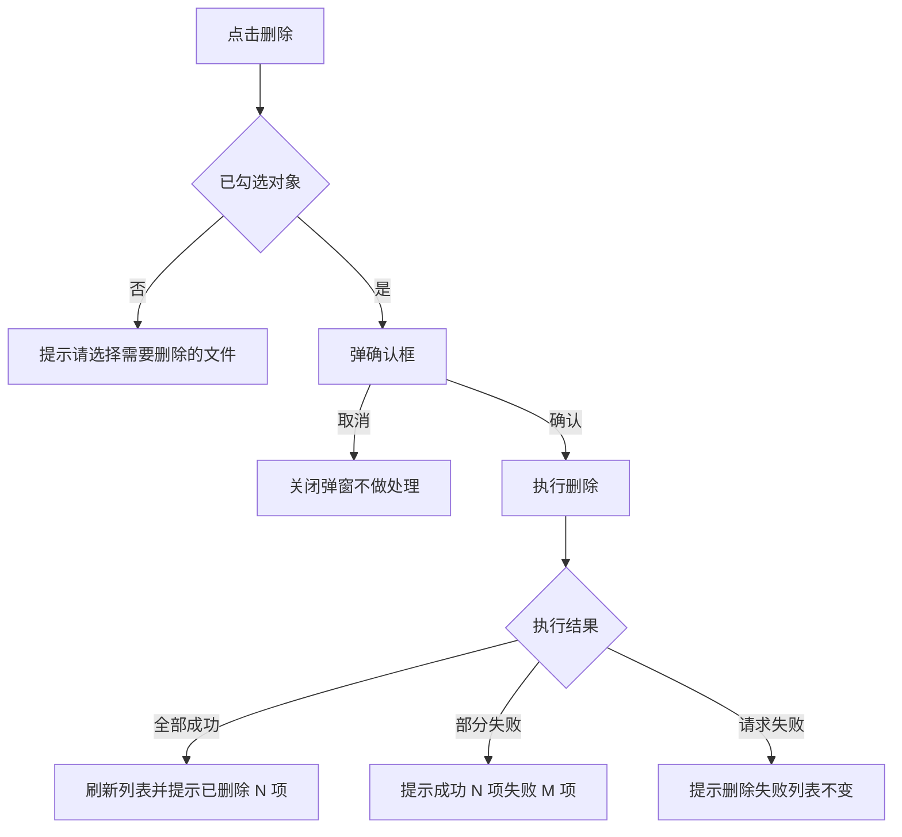
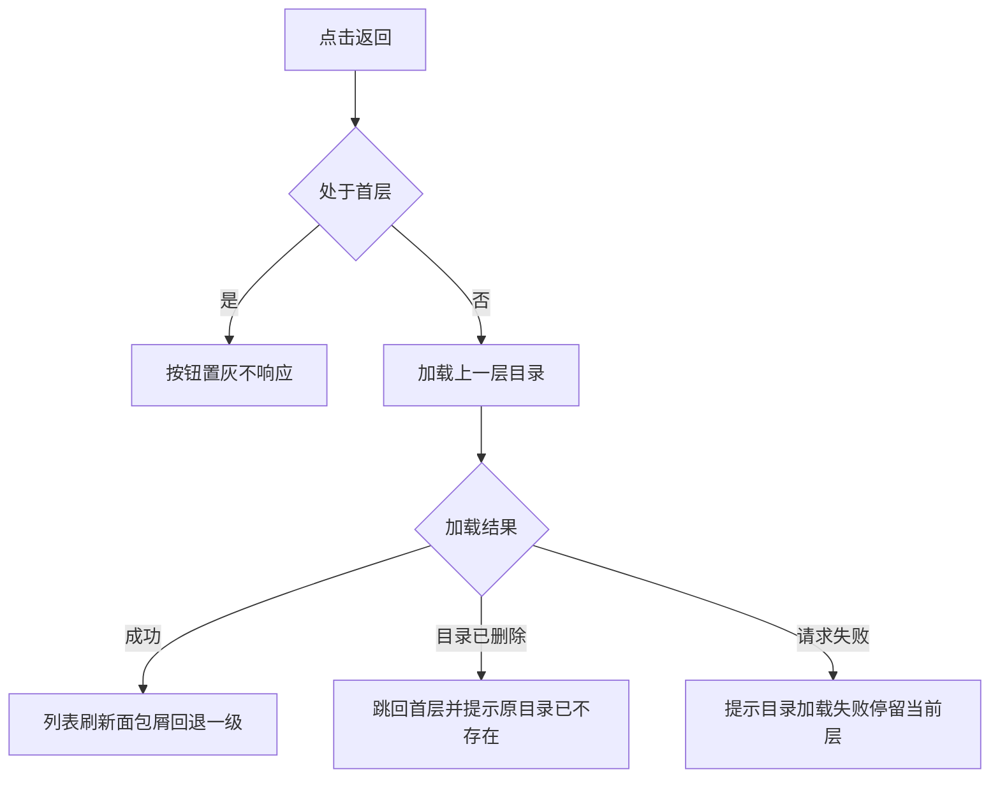

# 任务

> 需求说做什么，任务说怎么做。每个任务带界面图与完整交互规格，开发照着实现不需要回头问。

## Task-001：文件列表的删除操作

**关联需求**：REQ-1.0-003

### 任务内容
在文件列表操作区提供删除入口，支持多选批量删除，删除前需要确认。

### 界面

<!--annotation:list-->
<svg class="annotation" viewBox="0 0 2458 1402" role="img" aria-label="订单列表页界面标注">
	
	<image href="../prd-template/versions/1.0/diagrams/list.png" x="18" y="18" width="1440" height="927"/>
	<rect class="shot-b" x="18" y="18" width="1440" height="927"/>
	<rect class="mk-box" x="547.0" y="196.0" width="62.0" height="40.0" rx="3"/>
	<circle class="mk-bg" cx="533.0" cy="182.0" r="15"/>
	<text class="mk-no" x="533.0" y="188.3">1</text>
	<circle class="mk-bg" cx="1502.0" cy="159.9" r="15"/>
	<text class="mk-no" x="1502.0" y="166.2">1</text>
	<text class="mk-t" x="1546.0" y="168.5"><tspan x="1546.0" dy="0">1. 三个条件之间是且的关系，留空的条件不参与过滤</tspan><tspan x="1546.0" dy="38">2. 点击后表格进入 Loading 态，筛选条禁用</tspan><tspan x="1546.0" dy="38">3. 结果为空时表格区显示空态，保留筛选条让人能改条件</tspan><tspan x="1546.0" dy="38">4. 查询失败时保留上一次结果并在表格上方提示</tspan></text>
	<rect class="mk-box" x="611.0" y="196.0" width="62.0" height="40.0" rx="3"/>
	<circle class="mk-bg" cx="597.0" cy="182.0" r="15"/>
	<text class="mk-no" x="597.0" y="188.3">2</text>
	<circle class="mk-bg" cx="1502.0" cy="345.9" r="15"/>
	<text class="mk-no" x="1502.0" y="352.2">2</text>
	<text class="mk-t" x="1546.0" y="354.5"><tspan x="1546.0" dy="0">重置。清空三个条件并立即重新查询，不需要再点查询。</tspan></text>
	<rect class="mk-box" x="231.0" y="199.0" width="156.0" height="37.0" rx="3"/>
	<circle class="mk-bg" cx="217.0" cy="185.0" r="15"/>
	<text class="mk-no" x="217.0" y="191.3">3</text>
	<circle class="mk-bg" cx="1502.0" cy="417.9" r="15"/>
	<text class="mk-no" x="1502.0" y="424.2">3</text>
	<text class="mk-t" x="1546.0" y="426.5"><tspan x="1546.0" dy="0">状态。单选，默认全部，取值与表格状态列一致。</tspan></text>
	<rect class="mk-box" x="389.0" y="199.0" width="156.0" height="37.0" rx="3"/>
	<circle class="mk-bg" cx="375.0" cy="185.0" r="15"/>
	<text class="mk-no" x="375.0" y="191.3">4</text>
	<circle class="mk-bg" cx="1502.0" cy="489.9" r="15"/>
	<text class="mk-no" x="1502.0" y="496.2">4</text>
	<text class="mk-t" x="1546.0" y="498.5"><tspan x="1546.0" dy="0">创建日期。取单日不取区间，留空表示不限。</tspan></text>
	<rect class="mk-box" x="56.0" y="201.0" width="173.0" height="35.0" rx="3"/>
	<circle class="mk-bg" cx="42.0" cy="187.0" r="15"/>
	<text class="mk-no" x="42.0" y="193.3">5</text>
	<circle class="mk-bg" cx="1502.0" cy="561.9" r="15"/>
	<text class="mk-no" x="1502.0" y="568.2">5</text>
	<text class="mk-t" x="1546.0" y="570.5"><tspan x="1546.0" dy="0">订单号。支持前缀匹配，输入 PO-2026-09 可查出该月全部订单，不做</tspan><tspan x="1546.0" dy="38">模糊匹配。</tspan></text>
	<rect class="mk-box" x="1159.0" y="280.0" width="88.0" height="40.0" rx="3"/>
	<circle class="mk-bg" cx="1145.0" cy="266.0" r="15"/>
	<text class="mk-no" x="1145.0" y="272.3">6</text>
	<circle class="mk-bg" cx="1502.0" cy="671.9" r="15"/>
	<text class="mk-no" x="1502.0" y="678.2">6</text>
	<text class="mk-t" x="1546.0" y="680.5"><tspan x="1546.0" dy="0">1. 未勾选时导出当前筛选条件下的全部数据</tspan><tspan x="1546.0" dy="38">2. 已勾选时只导出勾选的行</tspan><tspan x="1546.0" dy="38">3. 点击后弹窗选择导出字段与格式</tspan><tspan x="1546.0" dy="38">4. 导出量超过一万条时改为异步任务，完成后站内信通知</tspan></text>
	<rect class="mk-box" x="1245.0" y="280.0" width="88.0" height="40.0" rx="3"/>
	<circle class="mk-bg" cx="1231.0" cy="266.0" r="15"/>
	<text class="mk-no" x="1231.0" y="272.3">7</text>
	<circle class="mk-bg" cx="1502.0" cy="857.9" r="15"/>
	<text class="mk-no" x="1502.0" y="864.2">7</text>
	<text class="mk-t" x="1546.0" y="866.5"><tspan x="1546.0" dy="0">1. 仅审批岗可见，操作岗不渲染该按钮</tspan><tspan x="1546.0" dy="38">2. 未勾选任何行时置灰，悬停提示先选择订单</tspan><tspan x="1546.0" dy="38">3. 点击后弹二次确认，列出将作废的订单号与总金额</tspan><tspan x="1546.0" dy="38">4. 确认后逐条提交，全部成功弹 toast 并刷新列表</tspan><tspan x="1546.0" dy="38">5. 部分失败则保留失败清单不关弹窗，让人能重试</tspan></text>
	<rect class="mk-box" x="1332.0" y="280.0" width="88.0" height="40.0" rx="3"/>
	<circle class="mk-bg" cx="1318.0" cy="266.0" r="15"/>
	<text class="mk-no" x="1318.0" y="272.3">8</text>
	<circle class="mk-bg" cx="1502.0" cy="1081.9" r="15"/>
	<text class="mk-no" x="1502.0" y="1088.2">8</text>
	<text class="mk-t" x="1546.0" y="1090.5"><tspan x="1546.0" dy="0">新建订单。跳转到新建页，草稿在离开页面时自动保存。</tspan></text>
	<rect class="mk-box" x="72.0" y="339.0" width="19.0" height="19.0" rx="3"/>
	<circle class="mk-bg" cx="58.0" cy="325.0" r="15"/>
	<text class="mk-no" x="58.0" y="331.3">9</text>
	<circle class="mk-bg" cx="1502.0" cy="1153.9" r="15"/>
	<text class="mk-no" x="1502.0" y="1160.2">9</text>
	<text class="mk-t" x="1546.0" y="1162.5"><tspan x="1546.0" dy="0">全选。只选中当前页的十行，翻页后不保留勾选状态。</tspan></text>
	<rect class="mk-box" x="1304.0" y="379.0" width="32.0" height="24.0" rx="3"/>
	<circle class="mk-bg" cx="1290.0" cy="365.0" r="15"/>
	<text class="mk-no" x="1290.0" y="371.3">10</text>
	<circle class="mk-bg" cx="1502.0" cy="1225.9" r="15"/>
	<text class="mk-no" x="1502.0" y="1232.2">10</text>
	<text class="mk-t" x="1546.0" y="1234.5"><tspan x="1546.0" dy="0">详情。在当前页打开详情，返回时保留原筛选条件与页码。</tspan></text>
	<rect class="mk-box" x="56.0" y="799.0" width="1364.0" height="37.0" rx="3"/>
	<circle class="mk-bg" cx="42.0" cy="785.0" r="15"/>
	<text class="mk-no" x="42.0" y="791.3">11</text>
	<circle class="mk-bg" cx="1502.0" cy="1297.9" r="15"/>
	<text class="mk-no" x="1502.0" y="1304.2">11</text>
	<text class="mk-t" x="1546.0" y="1306.5"><tspan x="1546.0" dy="0">分页。每页 10 条，总页数超过 5 页时折叠中间页码。</tspan></text>
</svg>
<!--/annotation-->

图注：操作区在列表右上角，删除与重命名、新建文件夹、下载到本地同一组。

### 流程

图注：提示文案在流程图里简写，完整原文见下方交互规格表。

### 交互规格

| 字段 | 内容 |
| --- | --- |
| 触发 | 点击操作区"删除"按钮 |
| 前置条件 | 列表中已勾选至少一个文件或文件夹 |
| 正常路径 | 弹确认框显示"确认删除选中的 {count} 项？" → 用户确认 → 执行删除 → 刷新列表 → 顶部提示"已删除 {count} 项" |
| 边界情况 | 未勾选任何对象时提示"请选择需要删除的文件/文件夹"，不弹确认框；勾选的文件夹非空时确认框追加一行"其中 {folderCount} 个文件夹包含子内容，将一并删除" |
| 错误处理 | 网络失败提示"删除失败，请重试"，列表保持原状不刷新；无权限提示"没有删除权限：{name}"，整批不执行 |
| 兜底行为 | 部分成功时提示"成功 {successCount} 项，失败 {failCount} 项"并列出失败项名称与原因，成功项保留删除结果不回滚 |
| 显示规则 | 删除执行中按钮置灰并显示加载态，防止重复点击；操作完成后勾选状态清空 |

### 验收
- 勾选单个文件删除后，列表不再显示该文件
- 未勾选时点击删除只出现提示，不出现确认框
- 勾选包含子内容的文件夹时，确认框显示子内容提示行
- 网络断开时删除失败，列表内容与删除前一致

## Task-002：返回上一层

**关联需求**：REQ-1.0-004

### 任务内容
在列表上方提供返回按钮，点击回到上一层目录。

### 流程

### 交互规格

| 字段 | 内容 |
| --- | --- |
| 触发 | 点击"返回"按钮 |
| 前置条件 | 当前不处于首层 |
| 正常路径 | 加载上一层目录 → 列表刷新 → 面包屑去掉最后一级 |
| 边界情况 | 处于首层时按钮字色置为 `#D7D7D7` 且不可点击，点击无任何反应也不提示 |
| 错误处理 | 上一层目录加载失败时提示"目录加载失败，请重试"，停留在当前层 |
| 兜底行为 | 上一层目录已被他人删除时，直接跳回首层并提示"原目录已不存在，已返回根目录" |
| 显示规则 | 返回过程中列表显示加载态，不显示空列表 |

### 验收
- 首层时返回按钮为灰色且点击无反应
- 非首层时点击返回，列表内容与面包屑同步回退一级
