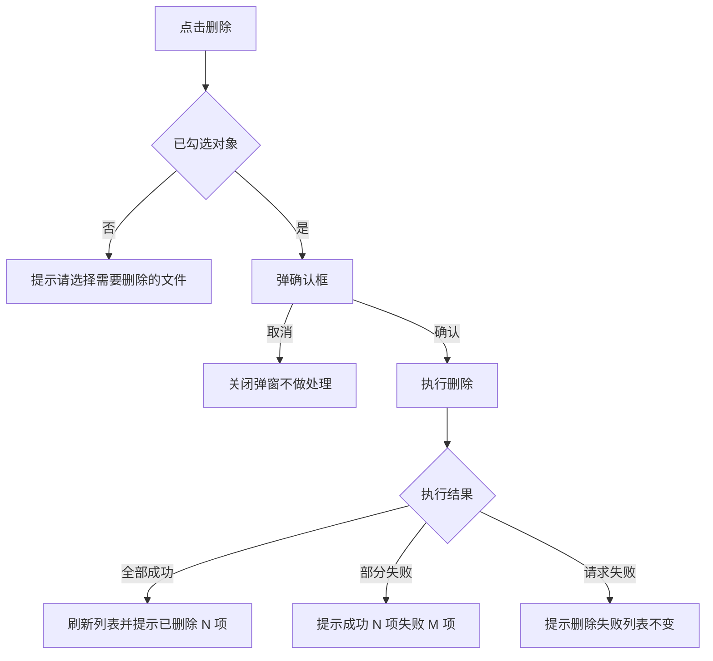
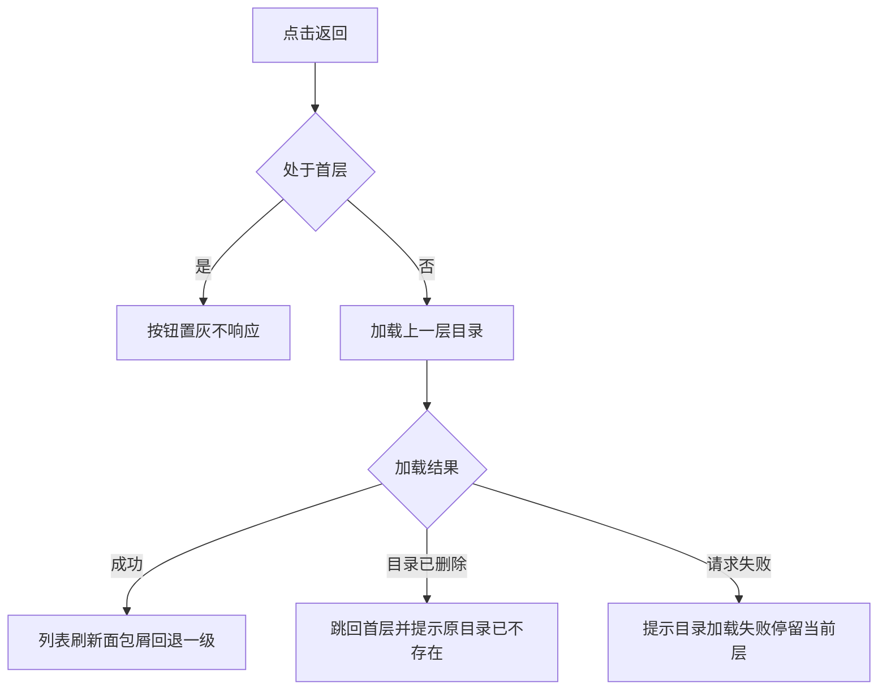

# 任务

> 需求说做什么，任务说怎么做。每个任务带界面图与完整交互规格，开发照着实现不需要回头问。

## Task-001：文件列表的删除操作

**关联需求**：REQ-1.0-003

### 任务内容
在文件列表操作区提供删除入口，支持多选批量删除，删除前需要确认。

### 界面

<svg class="annotation" xmlns="http://www.w3.org/2000/svg" viewBox="0 0 1600 900" role="img" aria-label="文件列表与操作区标注">
	<rect width="1600" height="900" fill="#ffffff"/>
	
	<defs>
		<marker id="dot" viewBox="0 0 8 8" refX="4" refY="4" markerWidth="5" markerHeight="5">
			<circle cx="4" cy="4" r="3" fill="#d93025"/>
		</marker>
	</defs>

	<rect class="panel" x="40" y="40" width="1000" height="760"/>

	<rect class="btn" x="70" y="70" width="240" height="44"/>
	<text class="ui-muted" x="88" y="99">文件名称</text>
	<rect class="btn-primary" x="326" y="70" width="90" height="44"/>
	<text class="ui" x="371" y="99" text-anchor="middle" fill="#ffffff">搜索</text>

	<rect class="btn" x="70" y="140" width="80" height="40"/>
	<text class="ui-muted" x="110" y="166" text-anchor="middle">返回</text>
	<text class="ui" x="176" y="166">归档文档</text>

	<line class="row-line" x1="70" y1="200" x2="1010" y2="200"/>
	<text class="ui-head" x="110" y="232">名称</text>
	<text class="ui-head" x="430" y="232">修改时间</text>
	<text class="ui-head" x="660" y="232">大小</text>
	<text class="ui-head" x="770" y="232">数量</text>
	<text class="ui-head" x="890" y="232">来源</text>
	<line class="row-line" x1="70" y1="250" x2="1010" y2="250"/>

	<rect class="btn" x="78" y="272" width="20" height="20"/>
	<rect x="112" y="270" width="26" height="22" fill="#f5b544" rx="3"/>
	<text class="ui" x="152" y="289">项目资料</text>
	<text class="ui" x="430" y="289">2026/04/21 19:04</text>
	<text class="ui" x="660" y="289">-</text>
	<text class="ui" x="770" y="289">5</text>
	<text class="ui" x="890" y="289">系统默认</text>
	<line class="row-line" x1="70" y1="312" x2="1010" y2="312"/>

	<rect class="btn" x="78" y="334" width="20" height="20"/>
	<rect x="112" y="332" width="26" height="22" fill="#f5b544" rx="3"/>
	<text class="ui" x="152" y="351">合同附件</text>
	<text class="ui" x="430" y="351">2026/04/21 19:04</text>
	<text class="ui" x="660" y="351">-</text>
	<text class="ui" x="770" y="351">3</text>
	<text class="ui" x="890" y="351">用户创建</text>
	<line class="row-line" x1="70" y1="374" x2="1010" y2="374"/>

	<rect class="btn" x="78" y="396" width="20" height="20"/>
	<rect x="112" y="394" width="26" height="22" fill="#8fb8de" rx="3"/>
	<text class="ui" x="152" y="413">验收报告.pdf</text>
	<text class="ui" x="430" y="413">2026/04/20 10:22</text>
	<text class="ui" x="660" y="413">2.4 Mb</text>
	<text class="ui" x="770" y="413">-</text>
	<text class="ui" x="890" y="413">用户创建</text>
	<line class="row-line" x1="70" y1="436" x2="1010" y2="436"/>

	<rect class="btn" x="1070" y="70" width="86" height="44"/>
	<text class="ui" x="1113" y="99" text-anchor="middle">删除</text>
	<rect class="btn" x="1166" y="70" width="104" height="44"/>
	<text class="ui" x="1218" y="99" text-anchor="middle">重命名</text>
	<rect class="btn" x="1280" y="70" width="140" height="44"/>
	<text class="ui" x="1350" y="99" text-anchor="middle">新建文件夹</text>
	<rect class="btn" x="1430" y="70" width="140" height="44"/>
	<text class="ui" x="1500" y="99" text-anchor="middle">下载到本地</text>

	<rect class="box-mark" x="1060" y="60" width="520" height="64"/>
	<text class="mark-strong" x="1060" y="150">操作区，每个按钮的完整规格见对应 Task</text>

	<rect class="box-mark" x="636" y="212" width="80" height="40"/>
	<path class="lead" d="M 676 206 L 676 176 L 1050 176"/>
	<text class="mark" x="1060" y="182">文件显示 Mb，文件夹显示 -</text>

	<rect class="box-mark" x="750" y="212" width="80" height="40"/>
	<path class="lead" d="M 830 232 L 1046 232"/>
	<text class="mark" x="1056" y="238">文件夹显示下一层数量，文件显示 -</text>

	<rect class="box-mark" x="864" y="264" width="130" height="180"/>
	<path class="lead" d="M 998 354 L 1050 354"/>
	<text class="mark" x="1060" y="330">来源三种取值</text>
	<text class="mark" x="1060" y="360">系统默认 / 用户创建</text>
	<text class="mark" x="1060" y="390">平台同步</text>

	<rect class="box-mark" x="70" y="136" width="80" height="48"/>
	<path class="lead" d="M 110 190 L 110 500 L 420 500"/>
	<text class="mark" x="430" y="492">处于首层无法返回时</text>
	<text class="mark" x="430" y="522">字色置为 #D7D7D7 且不可点击</text>

	<path class="lead" d="M 300 300 L 300 600 L 420 600"/>
	<text class="mark" x="430" y="592">单击整行等于勾选该行</text>
	<text class="mark" x="430" y="622">双击整行进入文件夹或打开文件</text>

	<rect class="box-mark" x="70" y="700" width="940" height="80"/>
	<text class="mark" x="90" y="732">未勾选任何对象时点击删除，提示"请选择需要删除的文件/文件夹"，不弹确认框</text>
	<text class="mark" x="90" y="762">勾选多个对象时点击重命名，提示"仅支持重命名单个文件/文件夹，请取消多选"</text>
</svg>

图注：操作区在列表右上角，删除与重命名、新建文件夹、下载到本地同一组。

### 流程

图注：提示文案在流程图里简写，完整原文见下方交互规格表。

### 交互规格

| 字段 | 内容 |
| --- | --- |
| 触发 | 点击操作区"删除"按钮 |
| 前置条件 | 列表中已勾选至少一个文件或文件夹 |
| 正常路径 | 弹确认框显示"确认删除选中的 {count} 项？" → 用户确认 → 执行删除 → 刷新列表 → 顶部提示"已删除 {count} 项" |
| 边界情况 | 未勾选任何对象时提示"请选择需要删除的文件/文件夹"，不弹确认框；勾选的文件夹非空时确认框追加一行"其中 {folderCount} 个文件夹包含子内容，将一并删除" |
| 错误处理 | 网络失败提示"删除失败，请重试"，列表保持原状不刷新；无权限提示"没有删除权限：{name}"，整批不执行 |
| 兜底行为 | 部分成功时提示"成功 {successCount} 项，失败 {failCount} 项"并列出失败项名称与原因，成功项保留删除结果不回滚 |
| 显示规则 | 删除执行中按钮置灰并显示加载态，防止重复点击；操作完成后勾选状态清空 |

### 验收
- 勾选单个文件删除后，列表不再显示该文件
- 未勾选时点击删除只出现提示，不出现确认框
- 勾选包含子内容的文件夹时，确认框显示子内容提示行
- 网络断开时删除失败，列表内容与删除前一致

## Task-002：返回上一层

**关联需求**：REQ-1.0-004

### 任务内容
在列表上方提供返回按钮，点击回到上一层目录。

### 流程

### 交互规格

| 字段 | 内容 |
| --- | --- |
| 触发 | 点击"返回"按钮 |
| 前置条件 | 当前不处于首层 |
| 正常路径 | 加载上一层目录 → 列表刷新 → 面包屑去掉最后一级 |
| 边界情况 | 处于首层时按钮字色置为 `#D7D7D7` 且不可点击，点击无任何反应也不提示 |
| 错误处理 | 上一层目录加载失败时提示"目录加载失败，请重试"，停留在当前层 |
| 兜底行为 | 上一层目录已被他人删除时，直接跳回首层并提示"原目录已不存在，已返回根目录" |
| 显示规则 | 返回过程中列表显示加载态，不显示空列表 |

### 验收
- 首层时返回按钮为灰色且点击无反应
- 非首层时点击返回，列表内容与面包屑同步回退一级
