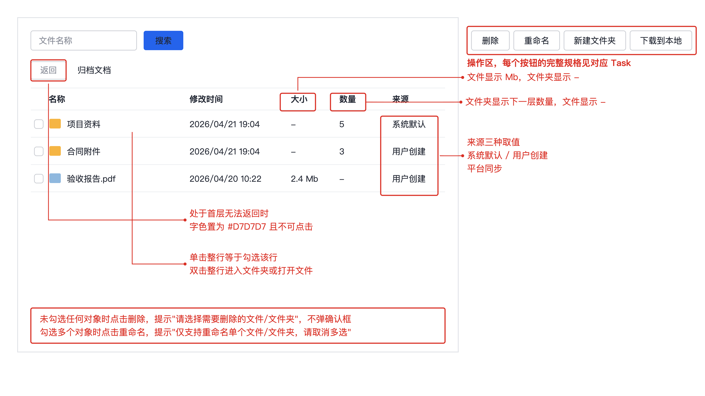

# 任务

> 需求说做什么，任务说怎么做。每个任务带界面图与完整交互规格，开发照着实现不需要回头问。

## Task-001：文件列表的删除操作

**关联需求**：REQ-1.0-003

### 任务内容
在文件列表操作区提供删除入口，支持多选批量删除，删除前需要确认。

### 界面

图注：操作区在列表右上角，删除与重命名、新建文件夹、下载到本地同一组。生成日期 2026-09-21。

### 交互规格

| 字段 | 内容 |
| --- | --- |
| 触发 | 点击操作区"删除"按钮 |
| 前置条件 | 列表中已勾选至少一个文件或文件夹 |
| 正常路径 | 弹确认框显示"确认删除选中的 {count} 项？" → 用户确认 → 执行删除 → 刷新列表 → 顶部提示"已删除 {count} 项" |
| 边界情况 | 未勾选任何对象时提示"请选择需要删除的文件/文件夹"，不弹确认框；勾选的文件夹非空时确认框追加一行"其中 {folderCount} 个文件夹包含子内容，将一并删除" |
| 错误处理 | 网络失败提示"删除失败，请重试"，列表保持原状不刷新；无权限提示"没有删除权限：{name}"，整批不执行 |
| 兜底行为 | 部分成功时提示"成功 {successCount} 项，失败 {failCount} 项"并列出失败项名称与原因，成功项保留删除结果不回滚 |
| 显示规则 | 删除执行中按钮置灰并显示加载态，防止重复点击；操作完成后勾选状态清空 |

### 验收
- 勾选单个文件删除后，列表不再显示该文件
- 未勾选时点击删除只出现提示，不出现确认框
- 勾选包含子内容的文件夹时，确认框显示子内容提示行
- 网络断开时删除失败，列表内容与删除前一致

## Task-002：返回上一层

**关联需求**：REQ-1.0-004

### 任务内容
在列表上方提供返回按钮，点击回到上一层目录。

### 交互规格

| 字段 | 内容 |
| --- | --- |
| 触发 | 点击"返回"按钮 |
| 前置条件 | 当前不处于首层 |
| 正常路径 | 加载上一层目录 → 列表刷新 → 面包屑去掉最后一级 |
| 边界情况 | 处于首层时按钮字色置为 `#D7D7D7` 且不可点击，点击无任何反应也不提示 |
| 错误处理 | 上一层目录加载失败时提示"目录加载失败，请重试"，停留在当前层 |
| 兜底行为 | 上一层目录已被他人删除时，直接跳回首层并提示"原目录已不存在，已返回根目录" |
| 显示规则 | 返回过程中列表显示加载态，不显示空列表 |

### 验收
- 首层时返回按钮为灰色且点击无反应
- 非首层时点击返回，列表内容与面包屑同步回退一级
