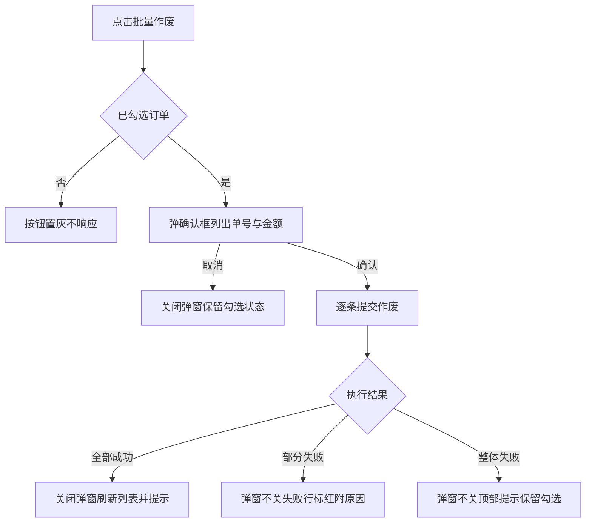
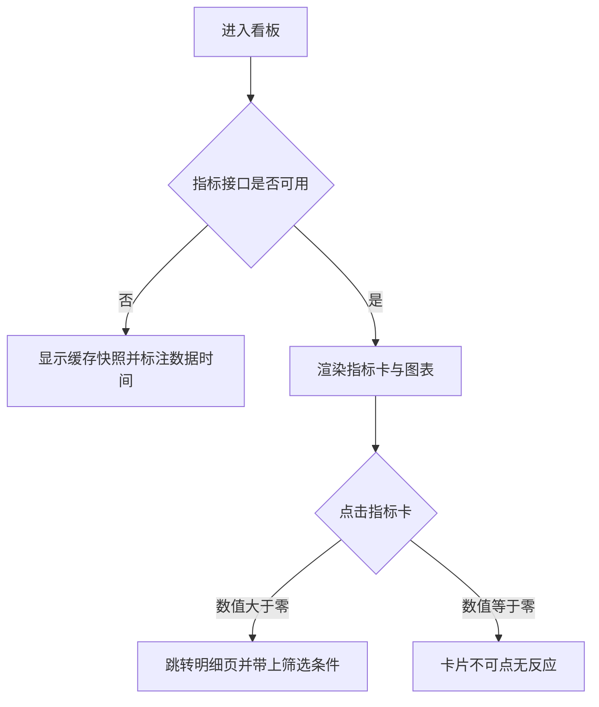

# Tasks 1.0

> 需求说做什么，任务说怎么做。每个任务带界面图与完整交互规格，开发照着实现不需要回头问。
> 编号 `Task-<三位序号>` 在本版本内唯一，引用时带版本路径（`1.0/Task-001`）。

## Task-001：订单列表与批量作废

**关联需求**：REQ-1.0-001、REQ-1.0-003

### 任务内容
提供订单列表的筛选、分页与批量操作，审批岗可以批量作废订单，作废前需要二次确认。

### 界面

<!--annotation:list-->
<svg class="annotation" viewBox="0 0 1476 963" role="img" aria-label="订单列表页界面标注">
	
	<image href="diagrams/list.png" x="18" y="18" width="1440" height="927"/>
	<rect class="shot-b" x="18" y="18" width="1440" height="927"/>
	<rect class="mk-box" x="56.0" y="201.0" width="173.0" height="35.0" rx="3"/>
	<circle class="mk-bg" cx="35.0" cy="180.0" r="22"/>
	<text class="mk-no" x="35.0" y="189.1">1</text>
	<rect class="mk-box" x="231.0" y="199.0" width="156.0" height="37.0" rx="3"/>
	<circle class="mk-bg" cx="210.0" cy="178.0" r="22"/>
	<text class="mk-no" x="210.0" y="187.1">2</text>
	<rect class="mk-box" x="389.0" y="199.0" width="156.0" height="37.0" rx="3"/>
	<circle class="mk-bg" cx="368.0" cy="178.0" r="22"/>
	<text class="mk-no" x="368.0" y="187.1">3</text>
	<rect class="mk-box" x="547.0" y="196.0" width="62.0" height="40.0" rx="3"/>
	<circle class="mk-bg" cx="526.0" cy="175.0" r="22"/>
	<text class="mk-no" x="526.0" y="184.1">4</text>
	<rect class="mk-box" x="611.0" y="196.0" width="62.0" height="40.0" rx="3"/>
	<circle class="mk-bg" cx="590.0" cy="175.0" r="22"/>
	<text class="mk-no" x="590.0" y="184.1">5</text>
	<rect class="mk-box" x="1159.0" y="280.0" width="88.0" height="40.0" rx="3"/>
	<circle class="mk-bg" cx="1138.0" cy="259.0" r="22"/>
	<text class="mk-no" x="1138.0" y="268.1">6</text>
	<rect class="mk-box" x="1245.0" y="280.0" width="88.0" height="40.0" rx="3"/>
	<circle class="mk-bg" cx="1224.0" cy="259.0" r="22"/>
	<text class="mk-no" x="1224.0" y="268.1">7</text>
	<rect class="mk-box" x="1332.0" y="280.0" width="88.0" height="40.0" rx="3"/>
	<circle class="mk-bg" cx="1311.0" cy="259.0" r="22"/>
	<text class="mk-no" x="1311.0" y="268.1">8</text>
	<rect class="mk-box" x="72.0" y="339.0" width="19.0" height="19.0" rx="3"/>
	<circle class="mk-bg" cx="51.0" cy="318.0" r="22"/>
	<text class="mk-no" x="51.0" y="327.1">9</text>
	<rect class="mk-box" x="1304.0" y="379.0" width="32.0" height="24.0" rx="3"/>
	<circle class="mk-bg" cx="1283.0" cy="358.0" r="22"/>
	<text class="mk-no" x="1283.0" y="367.1">10</text>
	<rect class="mk-box" x="56.0" y="799.0" width="1364.0" height="37.0" rx="3"/>
	<circle class="mk-bg" cx="35.0" cy="778.0" r="22"/>
	<text class="mk-no" x="35.0" y="787.1">11</text>
</svg>

1. **订单号**：支持前缀匹配，输入 PO-2026-09 可查出该月全部订单，不做模糊匹配。
2. **状态**：单选，默认全部，取值与表格状态列一致。
3. **创建日期**：取单日不取区间，留空表示不限。
4. **查询**
   1. 三个条件之间是且的关系，留空的条件不参与过滤
   2. 点击后表格进入 Loading 态，筛选条禁用
   3. 结果为空时表格区显示空态，保留筛选条让人能改条件
   4. 查询失败时保留上一次结果并在表格上方提示
5. **重置**：清空三个条件并立即重新查询，不需要再点查询。
6. **批量导出**
   1. 未勾选时导出当前筛选条件下的全部数据
   2. 已勾选时只导出勾选的行
   3. 点击后弹窗选择导出字段与格式
   4. 导出量超过一万条时改为异步任务，完成后站内信通知
7. **批量作废**
   1. 仅审批岗可见，采购岗不渲染该按钮
   2. 未勾选任何行时置灰，悬停提示先选择订单
   3. 点击后弹二次确认，列出将作废的订单号与总金额
   4. 确认后逐条提交，全部成功弹 toast 并刷新列表
   5. 部分失败则保留失败清单不关弹窗，让人能重试
8. **新建订单**：跳转到新建页，草稿在离开页面时自动保存。
9. **全选**：只选中当前页的十行，翻页后不保留勾选状态。
10. **详情**：在当前页打开详情，返回时保留原筛选条件与页码。
11. **分页**：每页 10 条，总页数超过 5 页时折叠中间页码。
<!--/annotation-->

图注：底图为原型真实截图，标注框坐标取自截图时的 DOM 量测，不手写，因此不会与原型脱节。红圈编号对应下方说明，多步骤操作按执行顺序编号。

<!--annotation:list-delete-modal-->
<svg class="annotation" viewBox="0 0 1476 794" role="img" aria-label="批量作废确认弹窗界面标注">
	
	<image href="diagrams/list-delete-modal.png" x="18" y="18" width="1440" height="758"/>
	<rect class="shot-b" x="18" y="18" width="1440" height="758"/>
	<rect class="mk-box" x="183.0" y="183.0" width="1110.0" height="428.4" rx="3"/>
	<circle class="mk-bg" cx="186.0" cy="186.0" r="22"/>
	<text class="mk-no" x="186.0" y="195.1">1</text>
	<rect class="mk-box" x="1032.6" y="466.2" width="202.8" height="87.6" rx="3"/>
	<circle class="mk-bg" cx="1035.6" cy="469.2" r="22"/>
	<text class="mk-no" x="1035.6" y="478.3">2</text>
	<rect class="mk-box" x="879.0" y="466.2" width="140.4" height="87.6" rx="3"/>
	<circle class="mk-bg" cx="882.0" cy="469.2" r="22"/>
	<text class="mk-no" x="882.0" y="478.3">3</text>
</svg>

1. **确认作废选中的订单**
   1. 宽 480px 水平居中，高度随内容增长，最高不超过视口的百分之八十
   2. 遮罩为半透明黑，点击遮罩不关闭，防止误触丢失已勾选的订单
   3. 按 Esc 等同点取消
   4. 打开期间锁定页面滚动，关闭后回到原滚动位置
2. **确认作废**
   1. 点击后按钮文案变为"提交中"并禁用，取消按钮同时禁用，防止重复提交
   2. 全部成功则关闭弹窗、弹 toast"已作废 {N} 条订单"、刷新列表并清空勾选
   3. 部分失败则弹窗不关，失败行标红并在行尾附失败原因，按钮文案变为"重试失败项"
   4. 整体失败则弹窗不关，顶部显示错误提示，保留全部勾选状态让人能直接重试
   5. 请求超过十秒未返回则按整体失败处理，提示改为"提交超时，请稍后重试"
3. **取消**：关闭弹窗并保留列表上的勾选状态，提交中禁用。
<!--/annotation-->

图注：弹窗整页截完在 A4 上只占中间一小块，截图清单用 `crop` 裁到弹窗周边，裁过的小截图会被等比放大填满图区。

### 流程

图注：提示文案在流程图里简写，完整原文见下方交互规格表。

### 交互规格

| 字段 | 内容 |
| --- | --- |
| 触发 | 点击操作区"批量作废"按钮 |
| 前置条件 | 当前角色为审批岗，且列表中已勾选至少一条订单 |
| 正常路径 | 弹确认框显示"确认作废选中的订单？"与"已选中 {count} 条订单" → 用户确认 → 逐条提交 → 关闭弹窗刷新列表 → 顶部提示"已作废 {count} 条订单" |
| 边界情况 | 未勾选时按钮置灰，悬停提示"请先选择订单"，不弹确认框；勾选项含已付款订单时确认框追加一行"已付款的订单需要先走退款流程"；勾选项全部为已作废状态时按钮保持置灰，不弹确认框 |
| 错误处理 | 网络失败提示"作废失败，请重试"，弹窗不关闭，列表保持原状；无权限提示"没有作废权限：{orderNo}"，整批不执行 |
| 兜底行为 | 部分成功时弹窗不关闭，失败行标红并在行尾附失败原因，按钮文案变为"重试失败项"，成功项不回滚；请求超过十秒未返回按整体失败处理，提示"提交超时，请稍后重试" |
| 显示规则 | 提交中按钮文案变为"提交中"并禁用，取消按钮同时禁用；操作完成后勾选状态清空；采购岗不渲染该按钮 |

### 验收
- 采购岗登录时页面上没有"批量作废"按钮
- 未勾选时点击无反应，悬停出现提示，不出现确认框
- 勾选含已付款订单时，确认框出现退款流程提示行
- 断网时作废失败，弹窗保持打开且勾选状态不丢

## Task-002：经营看板

**关联需求**：REQ-1.0-020、REQ-1.0-021

### 任务内容
按角色展示经营指标，指标卡可下钻到明细，趋势与异常用图表表达。

### 界面

<!--annotation:dashboard-->
<svg class="annotation" viewBox="0 0 1476 936" role="img" aria-label="经营看板界面标注">
	
	<image href="diagrams/dashboard.png" x="18" y="18" width="1440" height="900"/>
	<rect class="shot-b" x="18" y="18" width="1440" height="900"/>
	<rect class="mk-box" x="741.0" y="161.0" width="345.0" height="120.0" rx="3"/>
	<circle class="mk-bg" cx="744.0" cy="164.0" r="22"/>
	<text class="mk-no" x="744.0" y="173.1">1</text>
	<rect class="mk-box" x="743.0" y="291.0" width="694.0" height="355.0" rx="3"/>
	<circle class="mk-bg" cx="746.0" cy="294.0" r="22"/>
	<text class="mk-no" x="746.0" y="303.1">2</text>
</svg>

1. **延期风险订单**：可点击下钻，数值大于 0 时显示为红色，等于 0 时显示为默认色且不可点。
2. **准时交付率趋势**
   1. 折线图取最近六个月的准时交付率
   2. 低于 85% 的月份数据点标红
   3. 鼠标悬停显示该月的准时单数与总单数
   4. 点击数据点下钻到该月的延期订单清单
<!--/annotation-->

图注：看板必须有图表，指标卡只能表达当前值，趋势与异常要靠图看出来。

### 流程

### 交互规格

| 字段 | 内容 |
| --- | --- |
| 触发 | 单击指标卡或图表数据点 |
| 前置条件 | 当前角色有该指标的查看权限，且指标值大于 0 |
| 正常路径 | 点击后跳转到明细页，带上该指标对应的筛选条件与时间范围 |
| 边界情况 | 指标值为 0 时卡片不可点且不显示手型光标；图表无数据时显示空态并保留坐标轴，不隐藏整张图 |
| 错误处理 | 指标接口失败时显示缓存快照，顶部标注"数据截至 {time}"，不弹错误弹窗打断阅读 |
| 兜底行为 | 缓存也没有时整块显示失败态并提供重试按钮，不显示 0 冒充真实数据 |
| 显示规则 | 延期风险订单数大于 0 时显示为红色，等于 0 时显示默认色；金额千分位分隔，保留整数 |

### 验收
- 每张指标卡都能点，点击后明细页的筛选条件与卡片口径一致
- 看板至少有一张趋势图或对比图
- 断开指标接口后页面显示缓存快照与数据时间，不显示 0
