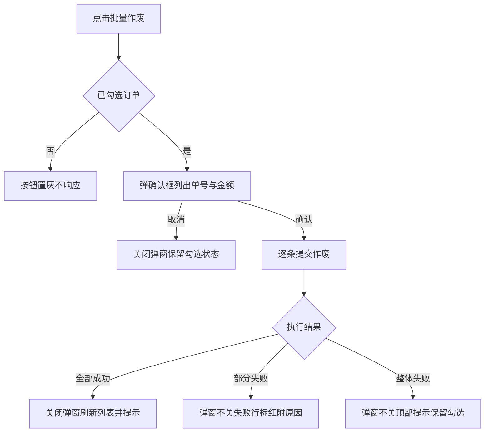
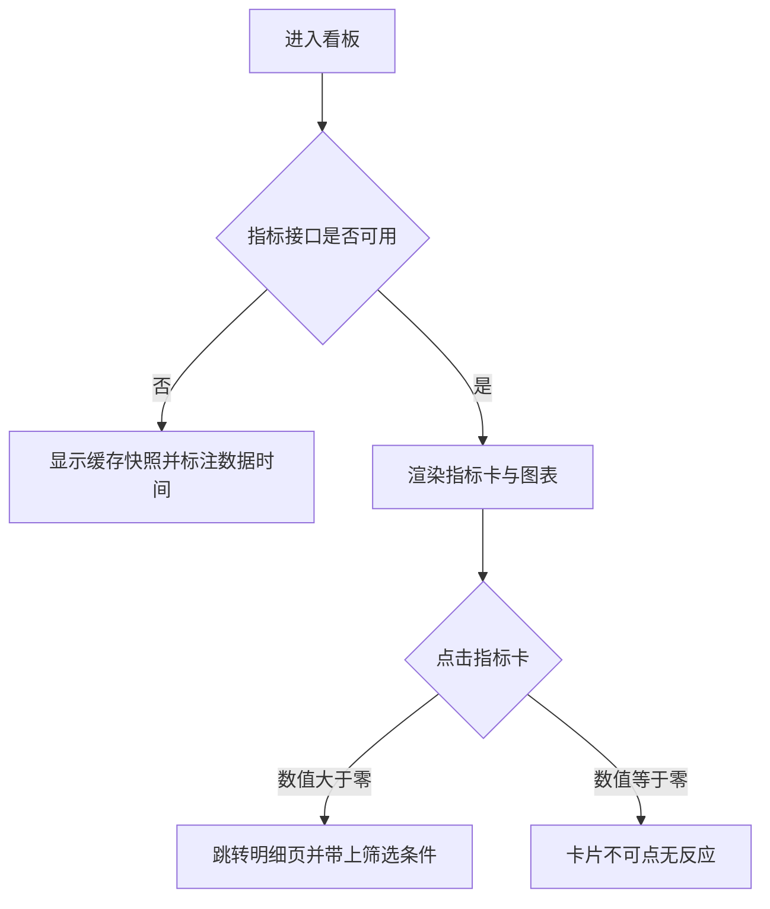

# Tasks 1.0

> 需求说做什么，任务说怎么做。每个任务带界面图与完整交互规格，开发照着实现不需要回头问。
> 编号 `Task-<三位序号>` 在本版本内唯一，引用时带版本路径（`1.0/Task-001`）。

## Task-001：订单列表与批量作废

**关联需求**：REQ-1.0-001、REQ-1.0-003

### 任务内容
提供订单列表的筛选、分页与批量操作，审批岗可以批量作废订单，作废前需要二次确认。

### 界面

<!--annotation:list-->
<!--/annotation-->

图注：底图为原型真实截图，标注框坐标取自截图时的 DOM 量测，不手写，因此不会与原型脱节。红圈编号对应右侧批注，多步骤操作按执行顺序编号。

<!--annotation:list-delete-modal-->
<!--/annotation-->

图注：弹窗整页截完在 A4 上只占中间一小块，截图清单用 `crop` 裁到弹窗周边，裁过的小截图会被等比放大填满图区。

### 流程

图注：提示文案在流程图里简写，完整原文见下方交互规格表。

### 交互规格

| 字段 | 内容 |
| --- | --- |
| 触发 | 点击操作区"批量作废"按钮 |
| 前置条件 | 当前角色为审批岗，且列表中已勾选至少一条订单 |
| 正常路径 | 弹确认框显示"确认作废选中的订单？"与"已选中 {count} 条订单" → 用户确认 → 逐条提交 → 关闭弹窗刷新列表 → 顶部提示"已作废 {count} 条订单" |
| 边界情况 | 1. 未勾选时按钮置灰，悬停提示"请先选择订单"，不弹确认框 2. 勾选项含已付款订单时确认框追加一行"已付款的订单需要先走退款流程" 3. 勾选项全部为已作废状态时按钮保持置灰，不弹确认框 |
| 错误处理 | 网络失败提示"作废失败，请重试"，弹窗不关闭，列表保持原状；无权限提示"没有作废权限：{orderNo}"，整批不执行 |
| 兜底行为 | 部分成功时弹窗不关闭，失败行标红并在行尾附失败原因，按钮文案变为"重试失败项"，成功项不回滚；请求超过十秒未返回按整体失败处理，提示"提交超时，请稍后重试" |
| 显示规则 | 1. 提交中按钮文案变为"提交中"并禁用，取消按钮同时禁用 2. 操作完成后勾选状态清空 3. 采购岗不渲染该按钮 |

### 验收
- 采购岗登录时页面上没有"批量作废"按钮
- 未勾选时点击无反应，悬停出现提示，不出现确认框
- 勾选含已付款订单时，确认框出现退款流程提示行
- 断网时作废失败，弹窗保持打开且勾选状态不丢

## Task-002：经营看板

**关联需求**：REQ-1.0-020、REQ-1.0-021

### 任务内容
按角色展示经营指标，指标卡可下钻到明细，趋势与异常用图表表达。

### 界面

<!--annotation:dashboard-->
<!--/annotation-->

图注：看板必须有图表，指标卡只能表达当前值，趋势与异常要靠图看出来。

### 流程

### 交互规格

| 字段 | 内容 |
| --- | --- |
| 触发 | 单击指标卡或图表数据点 |
| 前置条件 | 当前角色有该指标的查看权限，且指标值大于 0 |
| 正常路径 | 点击后跳转到明细页，带上该指标对应的筛选条件与时间范围 |
| 边界情况 | 指标值为 0 时卡片不可点且不显示手型光标；图表无数据时显示空态并保留坐标轴，不隐藏整张图 |
| 错误处理 | 指标接口失败时显示缓存快照，顶部标注"数据截至 {time}"，不弹错误弹窗打断阅读 |
| 兜底行为 | 缓存也没有时整块显示失败态并提供重试按钮，不显示 0 冒充真实数据 |
| 显示规则 | 延期风险订单数大于 0 时显示为红色，等于 0 时显示默认色；金额千分位分隔，保留整数 |

### 验收
- 每张指标卡都能点，点击后明细页的筛选条件与卡片口径一致
- 看板至少有一张趋势图或对比图
- 断开指标接口后页面显示缓存快照与数据时间，不显示 0
