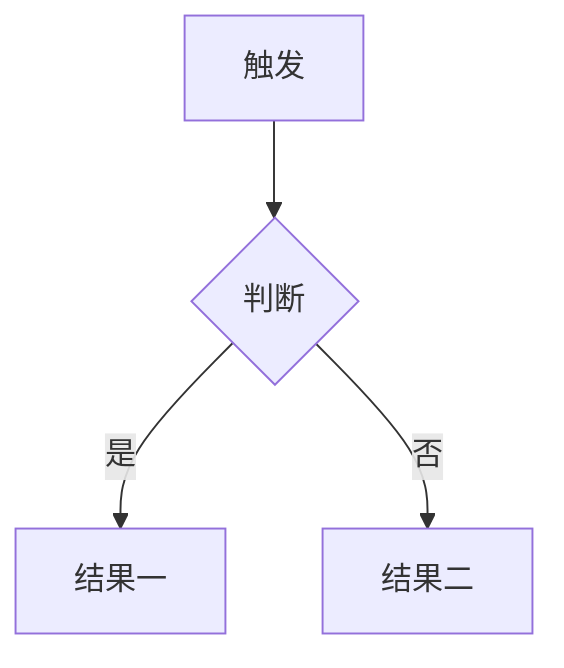

# Product 1.0

## 版本历史

| 版本 | 日期 | 变更内容 | 修订人 |
| --- | --- | --- | --- |
| 1.0 | YYYY-MM-DD | 初版 | 姓名 |

## 1. 需求概述

### 产品背景
为什么现在做这一版，当前的问题是什么。

### 本版目标
这一版最重要的结果是什么，用可判定的说法写。

### 价值点
做完之后谁获得什么，为什么值得投入。

### 涉及系统
本版需要对接或依赖的系统，每项写清系统名、对接内容、对接方。

| 系统 | 对接内容 | 对接方 |
| --- | --- | --- |
| 系统名 | 需要它提供什么或向它写入什么 | 负责人 |

### 风险说明
已知会影响交付的风险，每项写清风险、影响、应对。

| 风险 | 影响 | 应对 |
| --- | --- | --- |
| 风险描述 | 会导致什么 | 怎么处理或谁来定 |

## 2. 产品描述

### 名词解释
> 第一次出现的非通用术语必须进表。定义写清楚谁定的、取值范围是什么。

| 名词 | 定义 | 取值范围 | 定义来源 |
| --- | --- | --- | --- |
| 术语 | 一句话说清是什么 | 有枚举值时列出 | 业务方 / 本文档 / 外部标准 |

### 整体流程

图注：一句话说明这张图表达什么。

### 功能清单
> 先给全貌再展开细节。优先级用 P0 到 P2。

| 模块 | 功能 | 优先级 | 说明 |
| --- | --- | --- | --- |
| 模块名 | 功能名 | P0 | 一句话说清做什么 |

## 3. 功能需求

### 3.1 模块名

#### 场景描述
什么人在什么情况下用这个功能，用完达到什么状态。

#### 需求条目
> 每条必须带编号，格式 `REQ-<版本>-<三位序号>`。编号一经分配不再复用，需求作废时标注失效而不是删除条目。未经业务方确认的数值就地标注待确认。

- REQ-1.0-001 需求描述，写清行为与边界条件
- REQ-1.0-002 需求描述

#### 字段定义
> 涉及数据录入或展示的功能必须有字段表。不涉及数据的功能可以省略本节。

| 字段 | 类型 | 必填 | 约束 | 默认值 | 说明 |
| --- | --- | --- | --- | --- | --- |
| fieldName | String | 是 | 长度或取值限制 | 无 | 业务含义 |

#### 流程

## 4. 非功能需求
> 只写产品侧判据。响应时间、并发量、可用性指标这些工程指标归项目自己的交付体系，本文档不写。

### 权限与可见性
谁能看到什么、谁能改什么、跨角色的数据隔离规则。

### 数据留存
记录哪些数据、保留多久、谁能导出、到期后怎么处理。

### 统计与埋点
要回答哪些业务问题，因此需要记录哪些行为与字段。

### 安全底线
哪些操作必须留痕、哪些数据不能出现在日志与导出里、失败时能不能降级放行。

## 5. Non-goals
这一版明确不做什么，以及为什么不做。

## 6. 成功标准 / Release Criteria
> 只写产品维度的判据，每条都要能实测。工程交付标准由项目自己的规范体系管。

- 判据一
- 判据二

## 7. 未解决问题
> 每条写清：问题是什么、需要谁提供什么信息才能定、不定会影响哪些需求。

1. **问题标题**：需要什么信息才能确定，影响 REQ-1.0-00x
