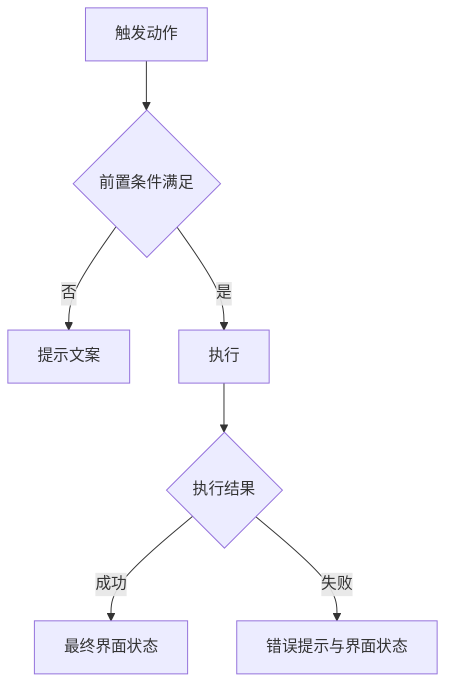

# Tasks 1.0
> 需求说做什么，任务说怎么做。每个任务带界面图与完整交互规格，开发照着实现不需要回头问。
> 编号 `Task-<三位序号>` 在本版本内唯一，引用时带版本路径（`1.0/Task-001`）。

## Task-001：[待填] 任务标题
**关联需求**：REQ-1.0-001

### 任务内容
[待填] 一句话说清这个任务要实现什么，不展开细节。

### 界面
[待填] 在 `diagrams/` 写截图清单与标注清单，用 `capture.mjs` 截图、`annotate.mjs` 生成标注图后，把本行换成标注标记块与图注。按钮触发的弹窗、空态、失败态各自出一张图。

### 流程
> 有两个以上分支的操作必须画，节点控制在 10 个以内。单一路径无分支时删掉流程图，写明"单一路径，无分支"。

### 交互规格
> 每个字段都要填，不适用就写"不适用"并说明原因。提示文案写完整原文加引号，变量用大括号标出。

| 字段 | 内容 |
| --- | --- |
| 触发 | [待填] 什么操作触发，单击、双击、长按还是键盘 |
| 前置条件 | [待填] 执行前必须满足什么状态 |
| 正常路径 | [待填] 一步步走通的流程与最终界面状态 |
| 边界情况 | [待填] 未选中、多选、空数据、首层末层、超长输入分别怎么处理 |
| 错误处理 | [待填] 失败时显示什么文案，界面回到什么状态 |
| 兜底行为 | [待填] 依赖不可用或部分失败时怎么降级 |
| 显示规则 | [待填] 字段为空或不适用时显示什么，状态如何呈现 |

### 验收
- [待填] 可以直接照着验证的条目，每条都能判断真假
