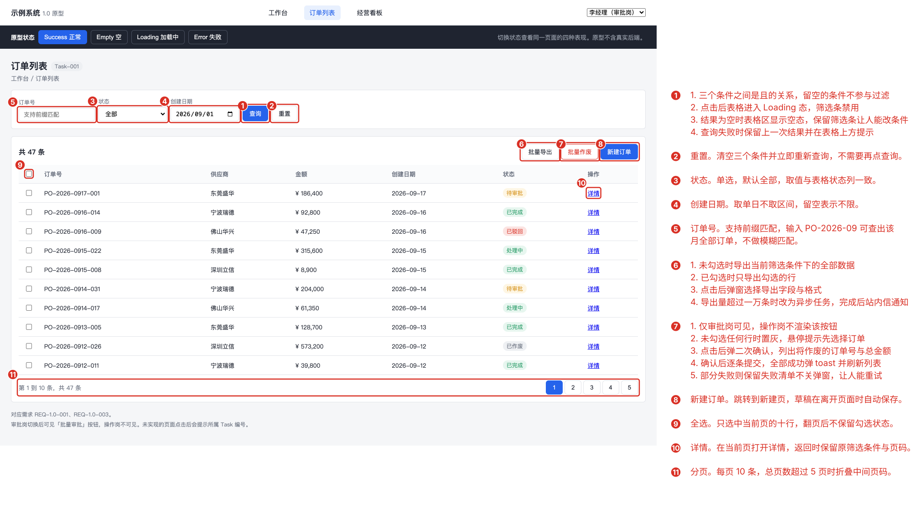
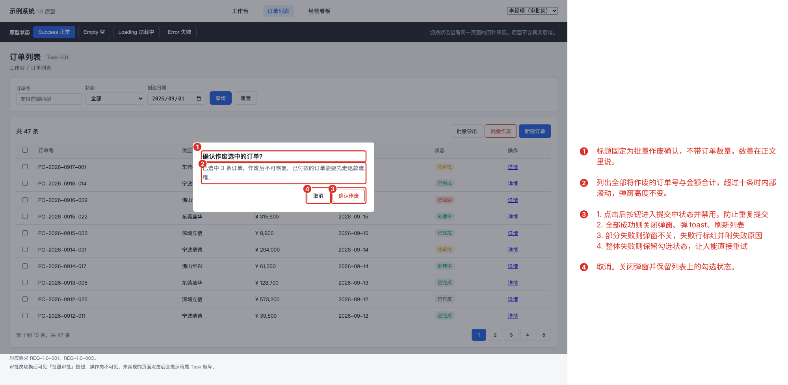
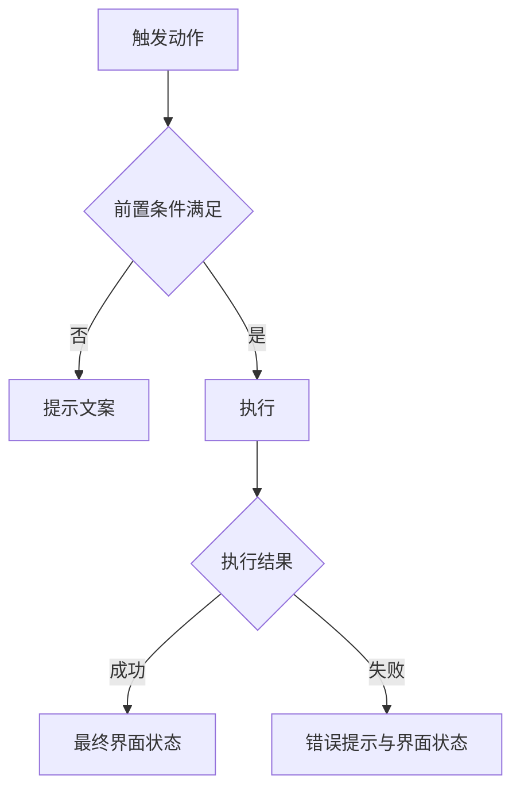

# Tasks 1.0

> 需求说做什么，任务说怎么做。每个任务带界面图与完整交互规格，开发照着实现不需要回头问。
> 编号 `Task-<三位序号>` 在本版本内唯一，引用时带版本路径（`1.0/Task-001`）。

## Task-001：任务标题

**关联需求**：REQ-1.0-001

### 任务内容
一句话说清这个任务要实现什么，不展开细节。

### 界面

图注：标注图由 `annotations/list.json` 生成，框选位置从原型 DOM 实时取得。原型改动后重跑 `node tools/annotate.mjs <清单>.json` 即可，不要手改 SVG。

图注：弹窗这类需要先触发才出现的界面，在清单的 `setup` 里写触发选择器。

### 流程

> 有两个以上分支的操作必须画，节点控制在 10 个以内。单一路径无分支时写明"单一路径，无分支"。

### 交互规格

> 七个字段都要填，不适用就写"不适用"并说明原因，留空等于没想清楚。提示文案写完整原文，变量用大括号标出。

| 字段 | 内容 |
| --- | --- |
| 触发 | 什么操作触发，单击、双击、长按还是键盘 |
| 前置条件 | 执行前必须满足什么状态 |
| 正常路径 | 一步步走通的流程与最终界面状态 |
| 边界情况 | 未选中、多选、空数据、首层末层、超长输入分别怎么处理 |
| 错误处理 | 失败时显示什么文案，界面回到什么状态 |
| 兜底行为 | 依赖不可用或部分失败时怎么降级 |
| 显示规则 | 字段为空或不适用时显示什么，状态如何呈现 |

### 验收
- 可以直接照着验证的条目，每条都能判断真假
