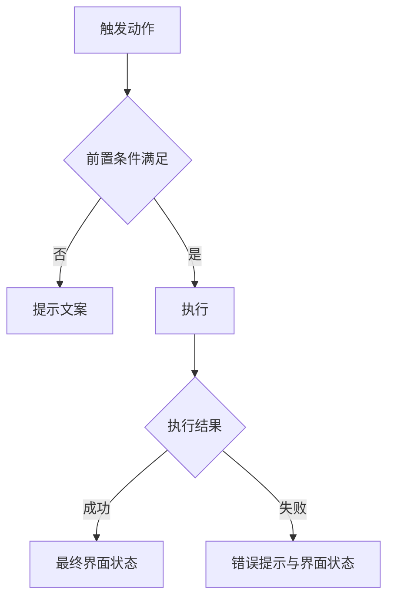
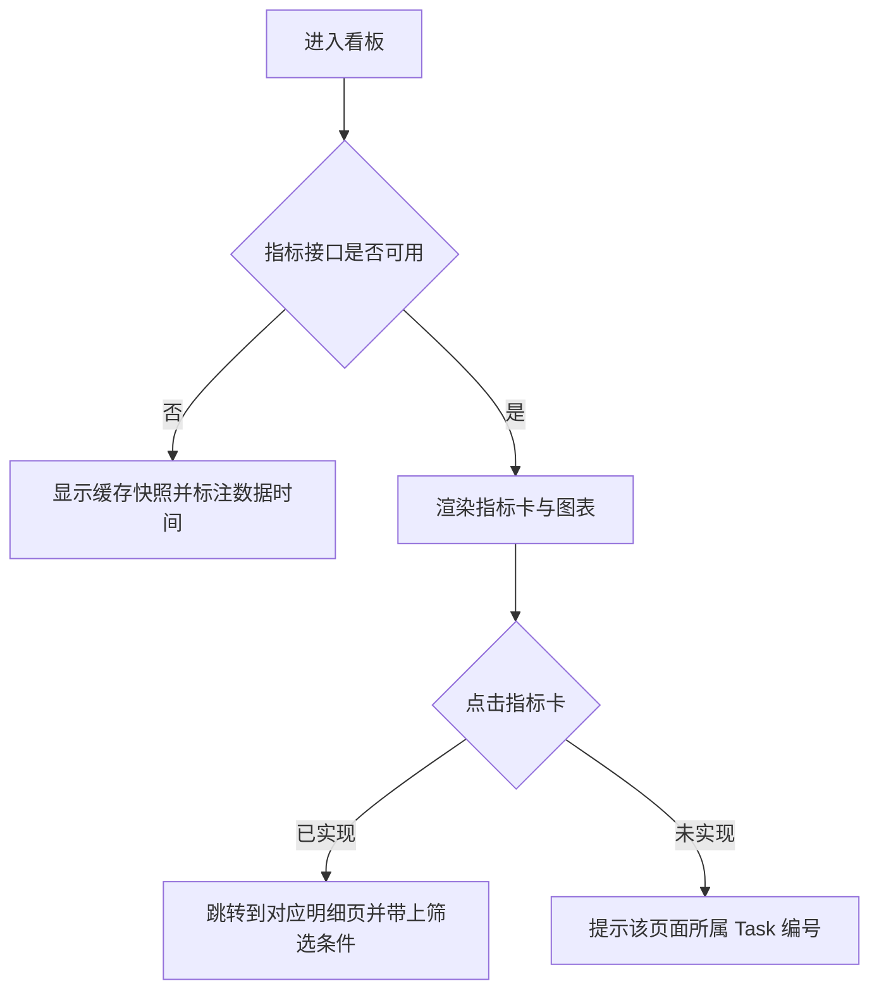

# Tasks 1.0

> 需求说做什么，任务说怎么做。每个任务带界面图与完整交互规格，开发照着实现不需要回头问。
> 编号 `Task-<三位序号>` 在本版本内唯一，引用时带版本路径（`1.0/Task-001`）。

## Task-001：任务标题

**关联需求**：REQ-1.0-001

### 任务内容
一句话说清这个任务要实现什么，不展开细节。

### 界面

<!--annotation:list-->
<svg class="annotation" viewBox="0 0 2458 1402" role="img" aria-label="订单列表页界面标注">
	
	<image href="diagrams/list.png" x="18" y="18" width="1440" height="927"/>
	<rect class="shot-b" x="18" y="18" width="1440" height="927"/>
	<rect class="mk-box" x="547.0" y="196.0" width="62.0" height="40.0" rx="3"/>
	<circle class="mk-bg" cx="533.0" cy="182.0" r="15"/>
	<text class="mk-no" x="533.0" y="188.3">1</text>
	<circle class="mk-bg" cx="1502.0" cy="159.9" r="15"/>
	<text class="mk-no" x="1502.0" y="166.2">1</text>
	<text class="mk-t" x="1546.0" y="168.5"><tspan x="1546.0" dy="0">1. 三个条件之间是且的关系，留空的条件不参与过滤</tspan><tspan x="1546.0" dy="38">2. 点击后表格进入 Loading 态，筛选条禁用</tspan><tspan x="1546.0" dy="38">3. 结果为空时表格区显示空态，保留筛选条让人能改条件</tspan><tspan x="1546.0" dy="38">4. 查询失败时保留上一次结果并在表格上方提示</tspan></text>
	<rect class="mk-box" x="611.0" y="196.0" width="62.0" height="40.0" rx="3"/>
	<circle class="mk-bg" cx="597.0" cy="182.0" r="15"/>
	<text class="mk-no" x="597.0" y="188.3">2</text>
	<circle class="mk-bg" cx="1502.0" cy="345.9" r="15"/>
	<text class="mk-no" x="1502.0" y="352.2">2</text>
	<text class="mk-t" x="1546.0" y="354.5"><tspan x="1546.0" dy="0">重置。清空三个条件并立即重新查询，不需要再点查询。</tspan></text>
	<rect class="mk-box" x="231.0" y="199.0" width="156.0" height="37.0" rx="3"/>
	<circle class="mk-bg" cx="217.0" cy="185.0" r="15"/>
	<text class="mk-no" x="217.0" y="191.3">3</text>
	<circle class="mk-bg" cx="1502.0" cy="417.9" r="15"/>
	<text class="mk-no" x="1502.0" y="424.2">3</text>
	<text class="mk-t" x="1546.0" y="426.5"><tspan x="1546.0" dy="0">状态。单选，默认全部，取值与表格状态列一致。</tspan></text>
	<rect class="mk-box" x="389.0" y="199.0" width="156.0" height="37.0" rx="3"/>
	<circle class="mk-bg" cx="375.0" cy="185.0" r="15"/>
	<text class="mk-no" x="375.0" y="191.3">4</text>
	<circle class="mk-bg" cx="1502.0" cy="489.9" r="15"/>
	<text class="mk-no" x="1502.0" y="496.2">4</text>
	<text class="mk-t" x="1546.0" y="498.5"><tspan x="1546.0" dy="0">创建日期。取单日不取区间，留空表示不限。</tspan></text>
	<rect class="mk-box" x="56.0" y="201.0" width="173.0" height="35.0" rx="3"/>
	<circle class="mk-bg" cx="42.0" cy="187.0" r="15"/>
	<text class="mk-no" x="42.0" y="193.3">5</text>
	<circle class="mk-bg" cx="1502.0" cy="561.9" r="15"/>
	<text class="mk-no" x="1502.0" y="568.2">5</text>
	<text class="mk-t" x="1546.0" y="570.5"><tspan x="1546.0" dy="0">订单号。支持前缀匹配，输入 PO-2026-09 可查出该月全部订单，不做</tspan><tspan x="1546.0" dy="38">模糊匹配。</tspan></text>
	<rect class="mk-box" x="1159.0" y="280.0" width="88.0" height="40.0" rx="3"/>
	<circle class="mk-bg" cx="1145.0" cy="266.0" r="15"/>
	<text class="mk-no" x="1145.0" y="272.3">6</text>
	<circle class="mk-bg" cx="1502.0" cy="671.9" r="15"/>
	<text class="mk-no" x="1502.0" y="678.2">6</text>
	<text class="mk-t" x="1546.0" y="680.5"><tspan x="1546.0" dy="0">1. 未勾选时导出当前筛选条件下的全部数据</tspan><tspan x="1546.0" dy="38">2. 已勾选时只导出勾选的行</tspan><tspan x="1546.0" dy="38">3. 点击后弹窗选择导出字段与格式</tspan><tspan x="1546.0" dy="38">4. 导出量超过一万条时改为异步任务，完成后站内信通知</tspan></text>
	<rect class="mk-box" x="1245.0" y="280.0" width="88.0" height="40.0" rx="3"/>
	<circle class="mk-bg" cx="1231.0" cy="266.0" r="15"/>
	<text class="mk-no" x="1231.0" y="272.3">7</text>
	<circle class="mk-bg" cx="1502.0" cy="857.9" r="15"/>
	<text class="mk-no" x="1502.0" y="864.2">7</text>
	<text class="mk-t" x="1546.0" y="866.5"><tspan x="1546.0" dy="0">1. 仅审批岗可见，采购岗不渲染该按钮</tspan><tspan x="1546.0" dy="38">2. 未勾选任何行时置灰，悬停提示先选择订单</tspan><tspan x="1546.0" dy="38">3. 点击后弹二次确认，列出将作废的订单号与总金额</tspan><tspan x="1546.0" dy="38">4. 确认后逐条提交，全部成功弹 toast 并刷新列表</tspan><tspan x="1546.0" dy="38">5. 部分失败则保留失败清单不关弹窗，让人能重试</tspan></text>
	<rect class="mk-box" x="1332.0" y="280.0" width="88.0" height="40.0" rx="3"/>
	<circle class="mk-bg" cx="1318.0" cy="266.0" r="15"/>
	<text class="mk-no" x="1318.0" y="272.3">8</text>
	<circle class="mk-bg" cx="1502.0" cy="1081.9" r="15"/>
	<text class="mk-no" x="1502.0" y="1088.2">8</text>
	<text class="mk-t" x="1546.0" y="1090.5"><tspan x="1546.0" dy="0">新建订单。跳转到新建页，草稿在离开页面时自动保存。</tspan></text>
	<rect class="mk-box" x="72.0" y="339.0" width="19.0" height="19.0" rx="3"/>
	<circle class="mk-bg" cx="58.0" cy="325.0" r="15"/>
	<text class="mk-no" x="58.0" y="331.3">9</text>
	<circle class="mk-bg" cx="1502.0" cy="1153.9" r="15"/>
	<text class="mk-no" x="1502.0" y="1160.2">9</text>
	<text class="mk-t" x="1546.0" y="1162.5"><tspan x="1546.0" dy="0">全选。只选中当前页的十行，翻页后不保留勾选状态。</tspan></text>
	<rect class="mk-box" x="1304.0" y="379.0" width="32.0" height="24.0" rx="3"/>
	<circle class="mk-bg" cx="1290.0" cy="365.0" r="15"/>
	<text class="mk-no" x="1290.0" y="371.3">10</text>
	<circle class="mk-bg" cx="1502.0" cy="1225.9" r="15"/>
	<text class="mk-no" x="1502.0" y="1232.2">10</text>
	<text class="mk-t" x="1546.0" y="1234.5"><tspan x="1546.0" dy="0">详情。在当前页打开详情，返回时保留原筛选条件与页码。</tspan></text>
	<rect class="mk-box" x="56.0" y="799.0" width="1364.0" height="37.0" rx="3"/>
	<circle class="mk-bg" cx="42.0" cy="785.0" r="15"/>
	<text class="mk-no" x="42.0" y="791.3">11</text>
	<circle class="mk-bg" cx="1502.0" cy="1297.9" r="15"/>
	<text class="mk-no" x="1502.0" y="1304.2">11</text>
	<text class="mk-t" x="1546.0" y="1306.5"><tspan x="1546.0" dy="0">分页。每页 10 条，总页数超过 5 页时折叠中间页码。</tspan></text>
</svg>
<!--/annotation-->

图注：底图为原型真实截图，标注框坐标取自截图时的 DOM 量测，不手写，因此不会与原型脱节。红圈编号对应右侧批注，多步骤操作按执行顺序编号。

<!--annotation:list-delete-modal-->
<svg class="annotation" viewBox="0 0 2458 1045" role="img" aria-label="批量作废确认弹窗界面标注">
	
	<image href="diagrams/list-delete-modal.png" x="18" y="18" width="1440" height="758"/>
	<rect class="shot-b" x="18" y="18" width="1440" height="758"/>
	<rect class="mk-box" x="183.0" y="183.0" width="1110.0" height="428.4" rx="3"/>
	<circle class="mk-bg" cx="186.0" cy="186.0" r="15"/>
	<text class="mk-no" x="186.0" y="192.3">1</text>
	<circle class="mk-bg" cx="1502.0" cy="341.1" r="15"/>
	<text class="mk-no" x="1502.0" y="347.4">1</text>
	<text class="mk-t" x="1546.0" y="349.7"><tspan x="1546.0" dy="0">1. 宽 480px 水平居中，高度随内容增长，最高不超过视口的百分之八十</tspan><tspan x="1546.0" dy="38">2. 遮罩为半透明黑，点击遮罩不关闭，防止误触丢失已勾选的订单</tspan><tspan x="1546.0" dy="38">3. 按 Esc 等同点取消</tspan><tspan x="1546.0" dy="38">4. 打开期间锁定页面滚动，关闭后回到原滚动位置</tspan></text>
	<rect class="mk-box" x="1032.6" y="466.2" width="202.8" height="87.6" rx="3"/>
	<circle class="mk-bg" cx="1035.6" cy="469.2" r="15"/>
	<text class="mk-no" x="1035.6" y="475.5">2</text>
	<circle class="mk-bg" cx="1502.0" cy="527.1" r="15"/>
	<text class="mk-no" x="1502.0" y="533.4">2</text>
	<text class="mk-t" x="1546.0" y="535.7"><tspan x="1546.0" dy="0">1. 点击后按钮文案变为「提交中」并禁用，取消按钮同时禁用，防止重</tspan><tspan x="1586.0" dy="38">复提交</tspan><tspan x="1546.0" dy="38">2. 全部成功则关闭弹窗、弹 toast「已作废 {N} 条订单」、刷新列</tspan><tspan x="1586.0" dy="38">表并清空勾选</tspan><tspan x="1546.0" dy="38">3. 部分失败则弹窗不关，失败行标红并在行尾附失败原因，按钮文案变</tspan><tspan x="1586.0" dy="38">为「重试失败项」</tspan><tspan x="1546.0" dy="38">4. 整体失败则弹窗不关，顶部显示错误提示，保留全部勾选状态让人能</tspan><tspan x="1586.0" dy="38">直接重试</tspan><tspan x="1546.0" dy="38">5. 请求超过十秒未返回则按整体失败处理，提示改为「提交超时，请稍</tspan><tspan x="1586.0" dy="38">后重试」</tspan></text>
	<rect class="mk-box" x="879.0" y="466.2" width="140.4" height="87.6" rx="3"/>
	<circle class="mk-bg" cx="882.0" cy="469.2" r="15"/>
	<text class="mk-no" x="882.0" y="475.5">3</text>
	<circle class="mk-bg" cx="1502.0" cy="941.1" r="15"/>
	<text class="mk-no" x="1502.0" y="947.4">3</text>
	<text class="mk-t" x="1546.0" y="949.7"><tspan x="1546.0" dy="0">取消。关闭弹窗并保留列表上的勾选状态，提交中禁用。</tspan></text>
</svg>
<!--/annotation-->

图注：弹窗这类需要先触发才出现的界面，在截图清单的 `setup` 里写触发选择器。

### 流程

> 有两个以上分支的操作必须画，节点控制在 10 个以内。单一路径无分支时写明"单一路径，无分支"。

### 交互规格

> 七个字段都要填，不适用就写"不适用"并说明原因，留空等于没想清楚。提示文案写完整原文，变量用大括号标出。

| 字段 | 内容 |
| --- | --- |
| 触发 | 什么操作触发，单击、双击、长按还是键盘 |
| 前置条件 | 执行前必须满足什么状态 |
| 正常路径 | 一步步走通的流程与最终界面状态 |
| 边界情况 | 未选中、多选、空数据、首层末层、超长输入分别怎么处理 |
| 错误处理 | 失败时显示什么文案，界面回到什么状态 |
| 兜底行为 | 依赖不可用或部分失败时怎么降级 |
| 显示规则 | 字段为空或不适用时显示什么，状态如何呈现 |

### 验收
- 可以直接照着验证的条目，每条都能判断真假

## Task-002：经营看板

**关联需求**：REQ-1.0-001

### 任务内容
按角色展示经营指标，指标卡可下钻，趋势与异常用图表表达。

### 界面

<!--annotation:dashboard-->
<svg class="annotation" viewBox="0 0 2458 936" role="img" aria-label="经营看板界面标注">
	
	<image href="diagrams/dashboard.png" x="18" y="18" width="1440" height="900"/>
	<rect class="shot-b" x="18" y="18" width="1440" height="900"/>
	<rect class="mk-box" x="741.0" y="161.0" width="345.0" height="120.0" rx="3"/>
	<circle class="mk-bg" cx="744.0" cy="164.0" r="15"/>
	<text class="mk-no" x="744.0" y="170.3">1</text>
	<circle class="mk-bg" cx="1502.0" cy="202.9" r="15"/>
	<text class="mk-no" x="1502.0" y="209.2">1</text>
	<text class="mk-t" x="1546.0" y="211.5"><tspan x="1546.0" dy="0">指标卡。可点击下钻，数值大于 0 时显示为红色，等于 0 时显示为默</tspan><tspan x="1546.0" dy="38">认色且不可点。</tspan></text>
	<rect class="mk-box" x="743.0" y="291.0" width="694.0" height="355.0" rx="3"/>
	<circle class="mk-bg" cx="746.0" cy="294.0" r="15"/>
	<text class="mk-no" x="746.0" y="300.3">2</text>
	<circle class="mk-bg" cx="1502.0" cy="412.4" r="15"/>
	<text class="mk-no" x="1502.0" y="418.7">2</text>
	<text class="mk-t" x="1546.0" y="421.0"><tspan x="1546.0" dy="0">1. 折线图取最近六个月的准时交付率</tspan><tspan x="1546.0" dy="38">2. 低于 85% 的月份数据点标红</tspan><tspan x="1546.0" dy="38">3. 鼠标悬停显示该月的准时单数与总单数</tspan><tspan x="1546.0" dy="38">4. 点击数据点下钻到该月的延期订单清单</tspan></text>
</svg>
<!--/annotation-->

图注：看板必须有图表，指标卡只能表达当前值。

### 流程

### 交互规格

| 字段 | 内容 |
| --- | --- |
| 触发 | 单击指标卡或图表数据点 |
| 前置条件 | 当前角色有该指标的查看权限 |
| 正常路径 | 点击后跳转到明细页，带上该指标对应的筛选条件与时间范围 |
| 边界情况 | 指标值为 0 时卡片不可点，图表无数据时显示空态并保留坐标轴 |
| 错误处理 | 指标接口失败时显示缓存快照，顶部标注数据截止时间 |
| 兜底行为 | 缓存也没有时整块显示失败态，提供重试按钮，不显示 0 冒充真实数据 |
| 显示规则 | 延期风险订单数大于 0 时显示为红色，等于 0 时显示默认色 |

### 验收
- 每张指标卡都能点，未实现的下钻页提示所属 Task 编号
- 看板至少有一张趋势图或对比图
- 指标接口失败时不显示 0，显示缓存快照或失败态
